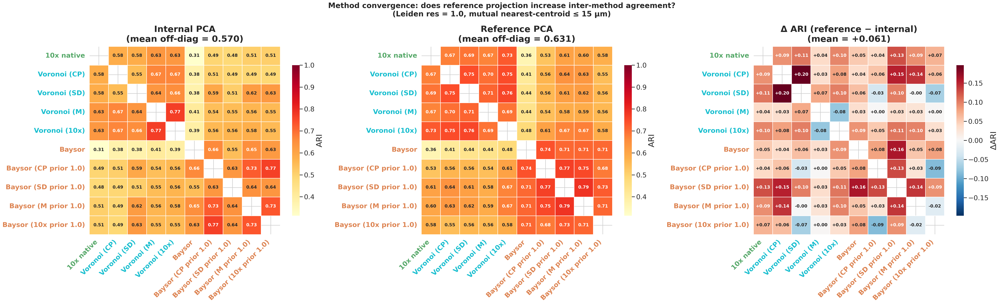
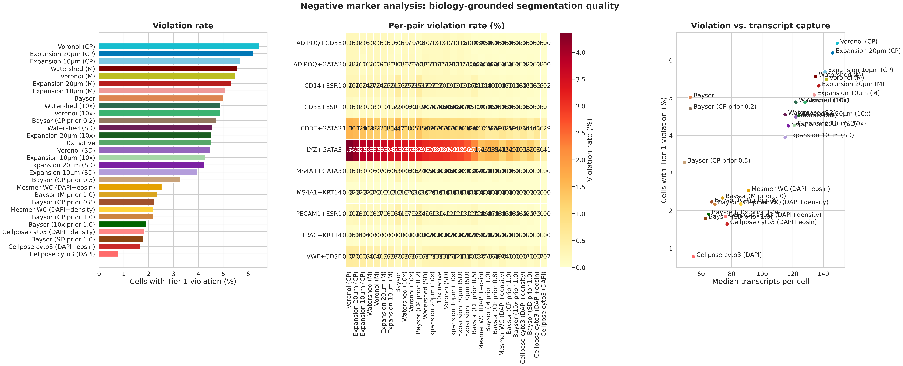
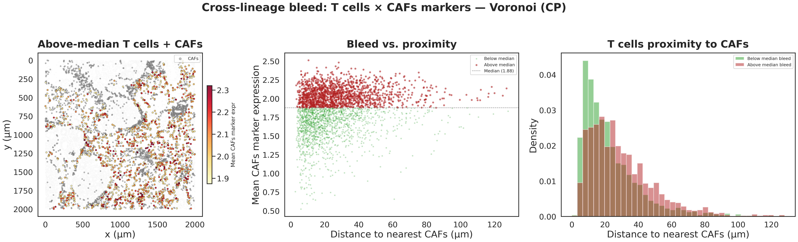

# Segmentation Benchmarking on Xenium Spatial Transcriptomics Data

**Question:** Do segmentation methods transfer well to Xenium spatial transcriptomics, does method choice meaningfully change downstream cell-type calls, and can we benchmark segmentation quality without relying on any single reference?

## Evaluation framework

Methods are evaluated along two orthogonal axes: a **factorial design** that decomposes segmentation into nuclear detection × expansion strategy, and a **three-anchor benchmark** that avoids privileging any single reference.

### N-detector × N-expansion factorial design

Every detector is paired with every expansion strategy, cleanly separating detection quality from expansion strategy. Four nuclear detectors (CellPose, StarDist, Mesmer, 10x Ranger) × expansion strategies (nuclear-only, geometric 10µm, geometric 20µm, Voronoi, watershed, Baysor PSC 0.2/0.5/0.8/1.0), plus whole-cell methods (Cellpose cyto3, Mesmer whole-cell) that produce masks directly.

### Three independent reference anchors

| Anchor | Information source | Strengths | Blind spots |
| --- | --- | --- | --- |
| **10x native** | Proprietary algorithm (DAPI-based) | Practical standard, most users' default | Black-box expansion, no ground truth |
| **H&E morphology** | DAPI + eosin whole-cell segmentation | Real cytoplasm boundaries from tissue morphology | Pre-IF registration artifacts, z-overlap |
| **scRNA-seq reference** | Dissociated single-cell data (GSE243275) | True single-cell expression profiles | Dissociation bias, loses spatial context |

Each method is evaluated against all three anchors. The anchors are also compared to each other: if all three agree that a method is good, that's robust. If they disagree, the pattern of disagreement reveals what each anchor is actually measuring — a method that scores high against 10x native but low against scRNA-seq is reproducing the platform's biases rather than recovering true cell states.

## Summary

The 4-detector × N-expansion factorial design cleanly separates nuclear detection quality from expansion strategy. Mesmer produces the best nuclear detections regardless of expansion method (Voronoi M: ARI 0.686, Baysor M prior: ARI 0.518), while 10x Ranger — despite being purpose-built for Xenium — is comparable to CellPose and StarDist. Voronoi consistently outperforms Baysor PSC=1.0 on ARI (0.58–0.69 vs 0.50–0.53) and cell-level displacement in scRNA-seq reference PCA space (0.92–1.41 vs 2.01–2.97 units). Voronoi methods also reproduce 10x native's cell type composition within 1–3 percentage points, while Baysor without a prior fundamentally reshapes it: luminal epithelial drops from 36.5% to 10.7% and CAFs rise from 28.3% to 37.2%.

The negative marker analysis — the one metric that requires no reference method — complicates this picture. Baysor prior variants have the lowest violation rates (2.17% raw, 0.31 per 1000 tx) compared to Voronoi (4.49–6.45%, 0.37–0.43 per 1000 tx), indicating that density-adaptive boundaries produce fewer cross-lineage contamination artifacts even where they disagree with 10x native. The cross-lineage bleed analysis confirms these violations are boundary artifacts: T cells near CAFs show elevated CAF-marker expression under Voronoi but not Baysor, with bleed intensity correlated to proximity to the nearest CAF.

Baysor's prior_segmentation_confidence parameter exhibits a sharp threshold between PSC 0.2 and 0.8 — below 0.2 the prior has almost no effect, while at 0.8+ cell counts nearly double, ARI jumps from 0.32 to 0.49, and negative marker violations halve. Among the four luminal epithelial subclusters, cluster 3 (NNMT/LUM/POSTN) was flagged as ambiguous — either genuine EMT or segmentation contamination. A cross-method comparison of stromal-to-luminal marker ratios (ranging from 2.90 for Baysor M prior to 3.69 for Voronoi CP) confirms that the stromal signal is at least partly a boundary artifact: methods with broader expansion pull proportionally more CAF transcripts into these cells.

Method ordering is stable across Leiden resolutions 0.3–2.0. In scRNA-seq reference PCA space, Voronoi and Baysor occupy distinct regions (within-family centroid distances 0.4–1.0 vs cross-family 1.7–3.4), and this block structure persists across all resolutions tested.

The H&E morphology anchor (Benchmark 2) produces a fundamentally different ranking. Whole-cell NN methods — which scored modestly on Benchmark 1 (ARI 0.54–0.62) — top the H&E ranking: Cellpose cyto3 DAPI+density reaches ARI 0.807, Mesmer WC density 0.776. Critically, 10x native itself scores only 0.590 against the H&E anchor — lower than 22 of 31 tested methods — revealing that the platform's proprietary expansion does not follow cytoplasm boundaries. Methods with the largest positive Benchmark 2 − Benchmark 1 delta are capturing real morphology; methods with negative deltas (Voronoi CP, Voronoi M, 10x native) are reproducing the platform's DAPI-expansion logic rather than cell shape.

### Full results table (Benchmark 1: 10x native anchor — original factorial methods)

| Comparison | Matched pairs | Median corr | ARI | Hungarian Disagree | Hungarian Moran's I | Argmax Disagree | Argmax Moran's I |
| --- | ---: | ---: | ---: | ---: | ---: | ---: | ---: |
| **Nuclear-only** | | | | | | | |
| 10x native vs. CellPose | 18,966 | 0.822 | 0.547 | 30.8% | 0.178 | 30.5% | 0.189 |
| 10x native vs. StarDist | 21,429 | 0.826 | 0.545 | 33.5% | 0.215 | 33.4% | 0.221 |
| 10x native vs. Mesmer | 20,595 | 0.879 | 0.557 | 27.9% | 0.090 | 27.4% | 0.098 |
| 10x native vs. 10x Ranger | 23,155 | 0.822 | 0.504 | 35.0% | 0.191 | 34.5% | 0.203 |
| **Voronoi** | | | | | | | |
| 10x native vs. Voronoi (CP) | 18,966 | 0.959 | 0.630 | 21.9% | 0.076 | 21.9% | 0.076 |
| 10x native vs. Voronoi (SD) | 21,428 | 0.959 | 0.584 | 31.9% | 0.194 | 27.7% | 0.229 |
| 10x native vs. Voronoi (M) | 20,595 | 0.964 | 0.686 | 18.8% | 0.161 | 18.8% | 0.161 |
| 10x native vs. Voronoi (10x) | 23,153 | 0.967 | 0.592 | 28.3% | 0.172 | 25.8% | 0.168 |
| **Baysor** | | | | | | | |
| 10x native vs. Baysor | 10,953 | 0.786 | 0.305 | 51.7% | 0.033 | 43.8% | 0.079 |
| 10x native vs. Baysor (CP prior 0.2) | 11,454 | 0.798 | 0.318 | 51.9% | 0.036 | 39.2% | 0.086 |
| 10x native vs. Baysor (CP prior 0.8) | 20,108 | 0.884 | 0.488 | 38.8% | 0.219 | 37.4% | 0.234 |
| 10x native vs. Baysor (CP prior 1.0) | 20,308 | 0.902 | 0.501 | 33.8% | 0.111 | 32.1% | 0.122 |
| 10x native vs. Baysor (SD prior 1.0) | 21,814 | 0.905 | 0.498 | 37.7% | 0.136 | 32.9% | 0.170 |
| 10x native vs. Baysor (M prior 1.0) | 21,148 | 0.924 | 0.518 | 32.3% | 0.115 | 30.7% | 0.119 |
| 10x native vs. Baysor (10x prior 1.0) | 22,910 | 0.914 | 0.530 | 34.7% | 0.208 | 33.1% | 0.204 |
| **New methods (triage vs. 10x native)** | | | | | | | |
| 10x native vs. Expansion 10µm (CP) | 19,343 | 0.981 | 0.604 | — | — | — | — |
| 10x native vs. Expansion 20µm (CP) | 19,343 | 0.982 | 0.603 | — | — | — | — |
| 10x native vs. Watershed (10x) | 23,142 | 0.979 | 0.664 | — | — | — | — |
| 10x native vs. Cellpose cyto3 (DAPI) | 19,765 | 0.854 | 0.540 | — | — | — | — |
| 10x native vs. Cellpose cyto3 (DAPI+eosin) | 16,740 | 0.911 | 0.598 | — | — | — | — |
| 10x native vs. Cellpose cyto3 (DAPI+density) | 19,714 | 0.903 | 0.569 | — | — | — | — |
| 10x native vs. Mesmer WC (DAPI+eosin) | 20,579 | 0.927 | 0.590 | — | — | — | — |
| 10x native vs. Mesmer WC (DAPI+density) | 20,316 | 0.913 | 0.617 | — | — | — | — |

*Matched pairs*: nearest-centroid matching. *Median corr*: per-pair Pearson correlation of log-normalised expression. *ARI*: Adjusted Rand Index. *Disagreement*: fraction of matched pairs assigned to different clusters after alignment. *—*: full-waterfall analysis pending for new methods. Nuclear-only methods capture 35–52% of transcripts and are excluded from downstream figures past the recovery section.

---

## Methods & Basic Statistics

### Dataset

**Xenium FFPE Human Breast (Custom Add-on Panel)**, Janesick et al. 2023, *Nature Communications* ([dataset page](https://www.10xgenomics.com/datasets/xenium-ffpe-human-breast-with-custom-add-on-panel-1-standard)). Invasive ductal carcinoma; matched scRNA-seq + Visium from the same tissue blocks: GEO [GSE243275](https://www.ncbi.nlm.nih.gov/geo/query/acc.cgi?acc=GSE243275).

All analysis runs on a 2mm × 2mm ROI (~23,600 cells, ~3.4M transcripts, 380-gene panel) with a mix of tumor, stroma, and immune-infiltrated regions. See [`docs/dataset.md`](docs/dataset.md) for download and ROI details.

### Methods

| Method | Input | Notes |
| --- | --- | --- |
| **10x native** | provided | Xenium Ranger's full segmentation (nuclear detection + proprietary expansion); used as Benchmark 1 anchor. |
| **10x Ranger** | DAPI | Nuclear detection component of Xenium Ranger, extracted from `nucleus_boundaries.parquet`. Included as a fourth nuclear detector. |
| **CellPose** | DAPI | CellPose 3.x `nuclei` model, CPU |
| **StarDist** | DAPI | `2D_versatile_fluo` model, separate `stardist` env |
| **Mesmer** | DAPI | DeepCell via Docker; image bundles model weights |
| **Voronoi (CP / SD / M / 10x)** | nuclear centroids | Nearest-centroid transcript assignment; 100% capture by construction |
| **Geometric 10µm / 20µm (CP / SD / M / 10x)** | nuclear mask | `skimage.expand_labels` with 10 or 20 µm radius; deterministic, fills to midpoint between cells |
| **Watershed (10x / SD / M)** | nuclear mask + DAPI | DAPI gradient as landscape, nuclear mask as seeds; `compactness=0.01`; 100% capture |
| **Baysor (prior 0.2 / 0.5 / 0.8 / 1.0)** | transcripts + nuclear masks | Transcript-density EM with `prior_segmentation_confidence` sweep. Tested with all four nuclear detectors at PSC 1.0. |
| **Cellpose cyto3** | DAPI / DAPI+eosin / DAPI+density | CellPose whole-cell `cyto3` model with three input variants |
| **Mesmer WC** | DAPI+eosin / DAPI+density | DeepCell whole-cell application via Docker; eosin channel from registered H&E provides cytoplasm signal |

Nuclear-only methods (CellPose, StarDist, Mesmer, 10x Ranger) capture only 35–52% of transcripts and are included in the recovery section but excluded from downstream figures because their low transcript capture dominates any comparison.

### Prior strength sweep

Baysor's `prior_segmentation_confidence` (PSC) controls how strongly the nuclear prior constrains the density model. At PSC=0.0 (no prior), Baysor runs purely on transcript density; at PSC=1.0, nuclear transcripts are hard-locked and only cytoplasmic transcripts use density-adaptive expansion. All CellPose-prior variants were run at PSC 0.0 (no prior), 0.2, 0.5, 0.8, and 1.0.

| PSC | Cells | Matched pairs | Median tx/cell | Median corr | ARI | Disagree (H) | Moran's I (H) | Tier 1 violations |
| ---: | ---: | ---: | ---: | ---: | ---: | ---: | ---: | ---: |
| 0.0 | 18,321 | 10,953 | 53 | 0.786 | 0.305 | 51.7% | 0.033 | 5.01% |
| 0.2 | 19,061 | 11,454 | 53 | 0.798 | 0.318 | 51.9% | 0.036 | — |
| 0.5 | 24,147 | — | — | — | — | — | — | — |
| 0.8 | 29,771 | 20,108 | 67 | 0.884 | 0.488 | 38.8% | 0.219 | 2.23% |
| 1.0 | 30,473 | 20,308 | 69 | 0.902 | 0.501 | 33.8% | 0.111 | 2.17% |

The sweep reveals a sharp transition between PSC 0.2 and 0.8. At PSC ≤ 0.2, the prior barely constrains the density model: cell counts, transcript capture, and ARI are nearly identical to the no-prior baseline. At PSC ≥ 0.8, the nuclear prior locks enough transcripts to prevent merging: cell counts jump to ~30,000, matched pairs nearly double, and ARI increases from 0.32 to 0.49. The Moran's I jump from 0.036 to 0.219 at PSC=0.8 indicates that the prior converts Baysor's diffuse, spatially random disagreement into structured disagreement concentrated at tissue boundaries. PSC=0.5 (24,147 cells) sits in the transition; full-waterfall analysis for this variant is pending.

### Cell and transcript recovery

**Nuclear detectors**

| Detector | Cells | Median tx/cell | Transcript capture |
| --- | ---: | ---: | ---: |
| CellPose | 20,166 | 49 | 35.4% |
| StarDist | 24,745 | 45 | 40.8% |
| Mesmer | 21,697 | 70 | 51.8% |
| 10x Ranger | 23,624 | 45 | 38.0% |

<p align="center"></p>

All four detectors operate on the same DAPI image but produce substantially different masks. Mesmer detects the largest nuclei (median ~45 µm², long tail to 200 µm²), capturing 51.8% of transcripts — nearly double CellPose's 35.4%. StarDist and 10x Ranger produce similar-sized masks but StarDist finds more nuclei (24,745 vs 23,624). 10x Ranger captures only 38% of transcripts despite detecting nearly as many cells as the 10x native whole-cell segmentation (23,624 vs 23,629), confirming that 10x native's 99% capture comes from its proprietary expansion, not from larger nuclei.

**Whole-cell and expansion methods**

| Method | Cells | Median tx/cell | Transcript capture |
| --- | ---: | ---: | ---: |
| 10x native (Ranger + proprietary expansion) | 23,629 | 124 | 99.0% |
| Voronoi (CP) | 20,166 | 149 | 100% |
| Voronoi (SD) | 24,745 | 122 | 100% |
| Voronoi (M) | 21,697 | 142 | 100% |
| Voronoi (10x) | 23,622 | 128 | 100% |
| Geometric 10µm (CP) | 20,166 | — | 95.9% |
| Geometric 20µm (CP) | 20,166 | — | 99.6% |
| Geometric 10µm (SD) | 24,745 | — | 95.9% |
| Geometric 20µm (SD) | 24,745 | — | 99.6% |
| Geometric 10µm (M) | 21,697 | — | 96.8% |
| Geometric 20µm (M) | 21,697 | — | 99.7% |
| Geometric 10µm (10x) | 23,624 | — | 96.2% |
| Geometric 20µm (10x) | 23,624 | — | 99.7% |
| Watershed (10x) | 23,142 | — | 100.0% |
| Watershed (SD) | 24,745 | — | 100.0% |
| Watershed (M) | 21,697 | — | 100.0% |
| Baysor (no prior) | 18,321 | 53 | 98.6% |
| Baysor (CP prior 0.2) | 19,061 | 53 | 98.7% |
| Baysor (CP prior 0.5) | 24,147 | — | — |
| Baysor (CP prior 0.8) | 29,771 | 67 | 99% |
| Baysor (CP prior 1.0) | 30,473 | 69 | 99% |
| Baysor (SD prior 1.0) | 34,230 | 63 | 98.9% |
| Baysor (M prior 1.0) | 31,764 | 74 | 98.9% |
| Baysor (10x prior 1.0) | 33,113 | 65 | 98.9% |
| Cellpose cyto3 (DAPI) | 19,765 | — | 40.8% |
| Cellpose cyto3 (DAPI+eosin) | 16,740 | — | 45.6% |
| Cellpose cyto3 (DAPI+density) | 19,714 | — | 54.6% |
| Mesmer WC (DAPI+eosin) | 21,841 | 91 | 68.3% |
| Mesmer WC (DAPI+density) | 21,493 | 86 | 63.7% |


Voronoi expansion captures 100% of transcripts by construction. Geometric expansion at 10µm captures ~96% and at 20µm ~99.6–99.7% regardless of detector; watershed fills the entire ROI (100%). Whole-cell NN methods are more conservative: Cellpose cyto3 captures only 41–55% (real cytoplasm boundaries leave extracellular gaps), while Mesmer WC captures 64–68% — substantially higher than Cellpose, suggesting Mesmer's training data better matches the tissue architecture. Baysor without a prior captures 98.6%, collapsing to ~11,000 matched cells due to cell merging.

---

## Benchmark 1: 10x Native Anchor

The 10x native segmentation is the platform's default output, produced by Xenium Ranger's proprietary DAPI-based algorithm. All methods are compared against it via centroid matching. Disagreement and spatial structure analyses throughout this section anchor on 10x native labels. This is the most direct measure of compatibility with the platform standard, but it treats 10x native as ground truth — any systematic biases in the platform's own algorithm are invisible to this benchmark.

### Per-cell expression correlation

<p align="center"></p>

Per-cell expression correlation is high for all methods (median 0.79–0.97). Voronoi methods lead (median r 0.96–0.97), with Voronoi (10x) highest at 0.967 because it shares nuclear seeds with 10x native and differs only in expansion algorithm. Baysor PSC=1.0 variants cluster at 0.90–0.92, and nuclear-only methods at 0.82–0.88, reflecting missing cytoplasmic transcripts rather than misassignment.

### Clustering comparison

Leiden clustering runs independently on each method's cells (normalize → PCA → neighbors → Leiden at resolution 1.0). Cluster labels are aligned across methods before computing confusion matrices and disagreement, using two algorithms: Hungarian (one-to-one) and argmax (many-to-one).

#### Resolution stability

<p align="center"></p>

ARI is partition-based and does not depend on cluster alignment, so it is the same under Hungarian and argmax. The method ordering is stable across Leiden resolutions 0.3–2.0. Voronoi (Mesmer) leads at most resolutions (0.3, 0.6, 0.8–1.2); at resolutions 0.5 and 0.7, Voronoi (StarDist) briefly takes the lead, and at 1.5+ StarDist's higher cell count gives it a durable advantage as finer clustering demands more cells per cluster. Baysor without a prior is consistently lowest.


Disagreement and Moran's I do depend on alignment. The Hungarian alignment forces unmatched clusters into poor pairings when cluster counts differ, inflating disagreement for methods that produce more clusters. The argmax alignment lets multiple clusters map to the same reference cluster, reducing this artifact. The Moran's I panel confirms that the spatial-structure gap is resolution-invariant under both algorithms: Voronoi and Baysor prior methods maintain spatially structured disagreement while Baysor without a prior stays near zero regardless of cluster granularity.

UMAP embeddings colored by aligned cluster labels illustrate how the alignment algorithm reshapes cluster identity. Baysor without a prior shows the starkest contrast: Hungarian forces 6 of its 21 clusters into empty pairings, leaving large regions unmatched (gray), while argmax lets multiple Baysor clusters map to the same reference cluster, producing coherent coloring across the manifold.


**All method UMAPs - Hungarian alignment**


**All method UMAPs - argmax alignment**


#### Cluster alignment

**Confusion matrices (Hungarian and argmax)**


Each row is one 10x native cluster; columns are the comparison method's clusters. Red cells mark Hungarian (one-to-one) matched pairs, blue cells mark argmax (many-to-one) matches, and purple cells mark pairs selected by both algorithms. Voronoi methods produce clean matches under both algorithms. Baysor's 15×21 matrix shows the key difference: under Hungarian, 6 clusters are forced into empty pairings; under argmax, every column maps to the highest-overlap reference cluster with no wasted assignments.

**Clustering agreement vs. 10x native**


Voronoi methods achieve the highest ARI (0.584–0.686), with Voronoi (M) leading. Nuclear-only methods cluster at ARI 0.504–0.557, and Baysor without a prior is lowest at 0.305. Argmax reduces Baysor's disagreement by ~8pp (51.7% to 43.8%) by eliminating forced mismatches from unmatched clusters. Voronoi methods with matched cluster counts are barely affected. The Moran's I increase for Baysor under argmax (0.033 to 0.079) shows that removing alignment noise reveals spatially structured disagreement that was previously masked.

**Per-cluster pseudobulk**

<p align="center"></p>

To test whether cluster-level expression profiles agree, matched cells are grouped by 10x native's 15 Leiden clusters and pseudobulked per method. Nuclear methods drop to r = 0.86–0.87 on luminal epithelial clusters (0, 1, 3, 8) — the same populations driving single-cell disagreement — while Voronoi variants stay above 0.99 across all clusters. Baysor shows a comparable luminal dip plus reduced correlation on macrophage clusters (2, 7), consistent with transcript-density boundaries partitioning those populations differently.

### Cell type composition vs. 10x native

To directly test whether segmentation method changes the apparent cell type composition of the tissue, each method's cells are annotated independently using `sc.tl.score_genes` on canonical marker panels. This bypasses Leiden clustering entirely — each cell is assigned to the cell type whose marker panel it scores highest on.

| Method | Lum. epi. | CAFs | Macro. | Endo. | T cells | Myoepi. | Sm. muscle | B cells | Plasma | Adipo. |
| --- | ---: | ---: | ---: | ---: | ---: | ---: | ---: | ---: | ---: | ---: |
| 10x native | 36.5 | 28.3 | 10.4 | 6.3 | 6.1 | 3.8 | 4.4 | 1.9 | 1.4 | 0.9 |
| Voronoi (CP) | 39.6 | 27.2 | 10.2 | 6.5 | 4.4 | 3.9 | 4.4 | 1.5 | 1.4 | 0.9 |
| Voronoi (SD) | 36.1 | 29.3 | 9.9 | 6.5 | 5.6 | 3.9 | 4.4 | 1.9 | 1.4 | 0.9 |
| Voronoi (M) | 37.1 | 28.9 | 10.3 | 6.4 | 5.3 | 3.7 | 4.2 | 1.9 | 1.3 | 0.9 |
| Voronoi (10x) | 36.8 | 29.1 | 9.7 | 6.5 | 5.7 | 3.9 | 4.1 | 1.9 | 1.4 | 0.9 |
| Baysor (no prior) | 10.7 | 37.2 | 20.0 | 5.7 | 9.1 | 5.8 | 3.7 | 3.0 | 2.3 | 2.4 |
| Baysor (CP prior 1.0) | 28.7 | 28.4 | 14.8 | 5.1 | 8.0 | 4.8 | 4.5 | 2.6 | 1.6 | 1.4 |
| Baysor (M prior 1.0) | 28.4 | 28.9 | 14.3 | 5.3 | 8.2 | 5.0 | 4.3 | 2.6 | 1.7 | 1.5 |

Voronoi methods reproduce 10x native's cell type composition within 1–3 percentage points across all cell types. The largest Voronoi deviation is Voronoi (CP) enriching luminal epithelial cells to 39.6% (vs 36.5%), consistent with fewer, larger cells concentrating more epithelial transcripts per cell.

Baysor without a prior fundamentally reshapes the tissue's apparent composition: luminal epithelial cells drop from 36.5% to 10.7% while CAFs rise to 37.2% and macrophages double to 20.0%. The density model's smaller cells (median 53 tx/cell) accumulate too few luminal markers to outscore the ambient stromal signature, so cells at tissue boundaries are reclassified from epithelial to stromal. Baysor with nuclear priors partially recovers (luminal 28.4–28.7%), but even at PSC=1.0 the composition remains shifted.

**Spatial cell type maps**


The spatial maps confirm the proportion shifts are not diffuse — they have clear tissue structure. Under 10x native and Voronoi methods, the tumor nests are dominated by luminal epithelial cells (pink), surrounded by CAF-rich stroma (gray) with immune infiltrate at the margins. Baysor without a prior fragments these epithelial regions: the density model's smaller cells lose enough luminal signal that many are reclassified as CAFs or macrophages, breaking up the coherent tumor structure.

### Spatial structure of disagreement


**Spatial disagreement maps (Hungarian alignment)**


**Spatial disagreement maps (Argmax alignment)**


**LISA hotspot/coldspot maps (Hungarian)**


**LISA hotspot/coldspot maps (argmax)**


| Comparison | Global Moran's I | HH hotspots | LL coldspots |
| --- | --- | --- | --- |
| 10x native vs. CellPose | 0.178 | 21.7% | 30.3% |
| 10x native vs. StarDist | 0.215 | 18.6% | 15.0% |
| 10x native vs. Mesmer | 0.090 | 17.1% | 32.5% |
| 10x native vs. Voronoi (CP) | 0.076 | 11.1% | 27.2% |
| 10x native vs. Voronoi (SD) | 0.194 | 23.2% | 30.8% |
| 10x native vs. Voronoi (M) | 0.161 | 9.5% | 20.4% |
| 10x native vs. Baysor | 0.033 | 21.4% | 17.5% |

Nuclear and Voronoi disagreements are spatially structured (Moran's I 0.076–0.215 under Hungarian), concentrated in luminal epithelial territory. Mesmer has the most agreement coldspots (32.5% LL); Voronoi (Mesmer) has the fewest disagreement hotspots (9.5% HH), consistent with residual errors being diffuse boundary noise. Under Hungarian alignment Baysor's near-zero Moran's I (0.033) reflects noise from forced cluster mismatches; under argmax alignment Moran's I increases to 0.079, revealing that Baysor's genuine disagreements are spatially structured — just less so than morphological methods.

*LISA labels*: Local Moran's I (Anselin 1995) decomposes the global statistic to a per-cell level. HH = disagreeing cell surrounded by disagreeing neighbors (hotspot), LL = agreeing cell surrounded by agreeing neighbors (coldspot), HL/LH = spatial outliers.

### Cell-type sensitivity

**Cell type vs. agreement (Hungarian)**


**Cell type vs. agreement (Argmax)**


Adipocytes and myoepithelial cells have the highest per-cell disagreement (~50–68% and ~40–47%) but are rare. Luminal epithelial cells dominate by volume: ~35% disagreement across ~8,500 cells drives the majority of total disagreement events. T cells and B cells are robustly identified regardless of method or alignment algorithm.

### Disagreement drivers: cell state vs. geometry

**Phenotypic density vs. disagreement (Hungarian)**


**Phenotypic density vs. disagreement (Argmax)**


**DE: disagree vs. agree cells (Hungarian)**


| Comparison | n agree / disagree | Median log-density (agree / disagree) | p |
| --- | --- | --- | --- |
| 10x native vs. CellPose | 13,121 / 5,845 | -21.31 / -20.78 | 2.9e-28 |
| 10x native vs. StarDist | 14,254 / 7,175 | -21.87 / -20.63 | 1.1e-90 |
| 10x native vs. Mesmer | 14,850 / 5,745 | -21.73 / -20.14 | 3.8e-79 |
| 10x native vs. Voronoi (CP) | 14,805 / 4,161 | -21.05 / -21.35 | 0.191 n.s. |
| 10x native vs. Voronoi (SD) | 14,597 / 6,831 | -21.74 / -20.56 | 5.5e-51 |
| 10x native vs. Voronoi (M) | 16,720 / 3,875 | -21.38 / -20.68 | 3.2e-12 |
| 10x native vs. Baysor | 5,286 / 5,667 | -22.76 / -22.75 | 0.756 n.s. |

Nuclear methods disagree on cells in higher-density phenotypic regions (Mann-Whitney p ≪ 0.001). The DE volcano confirms this: disagreeing cells are enriched for luminal epithelial markers (MYBPC1, SERPINA3, CLIC6, PGR, GATA3, MUC1), cytoplasmic transcripts underrepresented in nuclear-only masks. Voronoi (CellPose) disagreement is density-neutral (p = 0.19) with few DE genes, indicating residual errors are geometric. Baysor disagreement is also density-neutral but enriched for macrophage markers (CD14, MRC1, CD163), consistent with transcript-density boundaries partitioning macrophage-rich regions differently.

### Cell size and disagreement

**Cell size vs. disagreement (Hungarian)**


**Cell size vs. disagreement (Argmax)**


| Comparison | Median area (agree) | Median area (disagree) | p |
| --- | --- | --- | --- |
| 10x native vs. CellPose | 123.9 µm² | 121.4 µm² | 7.2e-07 |
| 10x native vs. StarDist | 121.2 µm² | 116.9 µm² | 2.4e-12 |
| 10x native vs. Mesmer | 126.2 µm² | 119.1 µm² | 3.2e-07 |
| 10x native vs. Voronoi (CP) | 126.8 µm² | 111.5 µm² | 4.9e-32 |
| 10x native vs. Voronoi (SD) | 123.8 µm² | 112.4 µm² | 8.8e-29 |
| 10x native vs. Voronoi (M) | 125.9 µm² | 117.7 µm² | 3.7e-19 |
| 10x native vs. Baysor | 167.0 µm² | 173.4 µm² | 0.28 n.s. |

Smaller 10x-native cells are significantly more likely to disagree with every morphological method (p ≪ 0.001). Smaller cells likely correspond to densely packed regions where any method's cluster assignment is noisier. Baysor shows no size dependence (p = 0.28); its boundaries are insensitive to morphologically defined cell area.

### Pairwise method agreement

<p align="center"></p>

Voronoi expansion does not improve cross-method reproducibility. CellPose and StarDist agree with each other at ARI 0.764 — higher than the Voronoi (CP) vs Voronoi (SD) pair at 0.661 — because both are nuclear-morphology methods operating on the same DAPI image. What Voronoi does raise is agreement with the 10x-native whole-cell reference (0.63–0.69): compatibility with the platform's own segmentation, not cross-method reproducibility. Baysor remains isolated from all morphological methods (ARI 0.30–0.46 regardless of partner).

---

## Benchmark 2: H&E Morphology Anchor

The H&E anchor is grounded in real cytoplasm and membrane signal from the registered H&E image. Eosin stains cytoplasm, stroma, and ECM; hematoxylin stains nuclei. After color deconvolution (`skimage.color.rgb2hed()`), the eosin channel provides a cytoplasm signal unavailable in the DAPI-only Xenium image. **Mesmer WC DAPI+eosin** is used as the H&E reference segmentation: it is the highest-performing eosin-based method (68.3% transcript capture vs. Cellpose cyto3's 45.6%) and uses the only available real cytoplasm channel.

Methods that score highly against this anchor capture real morphological boundaries; methods that score high against 10x native but low against this anchor are reproducing the platform's DAPI-expansion logic rather than tissue morphology.

### Registration quality

The H&E image was acquired pre-IF from registered tissue sections. Color deconvolution and pixel-level correlation were computed by `scripts/build_eosin_channel.py`. Hematoxylin vs. DAPI Pearson r = **0.896** (n=100,000 tissue pixels), confirming the registration is sufficient to use eosin as a second input channel. Registration is pre-IF (potential alignment artifacts) and does not resolve cells that overlap in z.

<p align="center"></p>

Nuclei appear white where DAPI (green) and hematoxylin (magenta) overlap, with minimal color fringing in both tumor-nest and stroma crops. The H&E anchor is trustworthy at the resolution of the 380-gene panel analysis; sub-cellular alignment errors are not expected to materially affect cell-level transcript assignment.

### Results: all methods vs. H&E morphology anchor

| Method | n_matched | Median corr | ARI (H&E anchor) | ARI (10x anchor) | Δ (H&E − 10x) |
| --- | ---: | ---: | ---: | ---: | ---: |
| **Whole-cell NN** | | | | | |
| Cellpose cyto3 (DAPI+density) | 19,625 | 0.962 | 0.807 | 0.569 | +0.238 |
| Mesmer WC (DAPI+density) | 20,747 | 0.977 | 0.776 | 0.617 | +0.159 |
| Cellpose cyto3 (DAPI+eosin) | 16,467 | 0.958 | 0.709 | 0.598 | +0.111 |
| Cellpose cyto3 (DAPI only) | 19,146 | 0.905 | 0.675 | 0.540 | +0.135 |
| **Nuclear-only** | | | | | |
| Mesmer | 20,951 | 0.949 | 0.727 | 0.557 | +0.170 |
| StarDist | 20,859 | 0.888 | 0.669 | 0.545 | +0.124 |
| CellPose | 18,624 | 0.873 | 0.701 | 0.547 | +0.154 |
| 10x Ranger | 20,641 | 0.870 | 0.689 | 0.504 | +0.185 |
| **Geometric expansion** | | | | | |
| Expansion 10µm (SD) | 20,895 | 0.930 | 0.728 | — | — |
| Expansion 20µm (SD) | 20,634 | 0.928 | 0.714 | — | — |
| Expansion 10µm (M) | 20,954 | 0.945 | 0.616 | — | — |
| Expansion 20µm (M) | 20,740 | 0.944 | 0.636 | — | — |
| Expansion 10µm (10x) | 20,687 | 0.928 | 0.621 | — | — |
| Expansion 20µm (10x) | 20,469 | 0.926 | 0.590 | — | — |
| Expansion 10µm (CP) | 18,709 | 0.930 | 0.552 | 0.604 | −0.052 |
| Expansion 20µm (CP) | 18,508 | 0.927 | 0.626 | 0.603 | +0.023 |
| **Watershed** | | | | | |
| Watershed (10x) | 19,960 | 0.933 | 0.711 | 0.664 | +0.047 |
| Watershed (M) | 20,172 | 0.949 | 0.658 | — | — |
| Watershed (SD) | 20,139 | 0.935 | 0.598 | — | — |
| **Voronoi** | | | | | |
| Voronoi (SD) | 20,859 | 0.914 | 0.664 | 0.584 | +0.080 |
| Voronoi (M) | 20,951 | 0.927 | 0.605 | 0.686 | −0.081 |
| Voronoi (10x) | 20,641 | 0.915 | 0.632 | 0.592 | +0.040 |
| Voronoi (CP) | 18,624 | 0.916 | 0.542 | 0.630 | −0.088 |
| **10x native** | 20,579 | 0.927 | **0.590** | 1.000 | −0.410 |
| **Baysor** | | | | | |
| Baysor (M prior 1.0) | 20,937 | 0.945 | 0.698 | 0.518 | +0.180 |
| Baysor (10x prior 1.0) | 20,645 | 0.911 | 0.681 | 0.530 | +0.151 |
| Baysor (SD prior 1.0) | 20,905 | 0.917 | 0.646 | 0.498 | +0.148 |
| Baysor (CP prior 1.0) | 19,465 | 0.912 | 0.654 | 0.501 | +0.153 |
| Baysor (CP prior 0.8) | 19,255 | 0.897 | 0.590 | 0.488 | +0.102 |
| Baysor (CP prior 0.5) | 14,644 | 0.843 | 0.473 | — | — |
| Baysor (CP prior 0.2) | 10,567 | 0.847 | 0.415 | 0.318 | +0.097 |
| Baysor (no prior) | 9,998 | 0.839 | 0.471 | 0.305 | +0.166 |

The H&E anchor reveals a strikingly different method ranking than the 10x native anchor. Three patterns stand out.

**Whole-cell NN methods ranked at the top here but not on B1.** Cellpose cyto3 DAPI+density scores ARI 0.807 — highest of all — compared to 0.569 against 10x native. Mesmer WC density jumps from 0.617 to 0.776. These methods were trained to segment whole cells against cytoplasm signal; against an anchor that is itself eosin-derived, they perform far better than their B1 scores suggested. Their apparently weak B1 performance reflects that 10x native's proprietary expansion does not follow cytoplasm boundaries.

**10x native scores only 0.590 against the H&E anchor.** This is the lowest among all expansion methods and below every Voronoi variant. The platform's own segmentation agrees moderately at best with what real tissue morphology looks like — its DAPI-based expansion assigns transcripts in a pattern that diverges substantially from cytoplasm extent. Methods designed to agree with 10x native (all B1 analysis) are therefore not necessarily capturing real cell morphology.

**Nuclear-only detectors score higher against H&E (0.67–0.73) than against 10x native (0.50–0.56).** Mesmer nuclear alone achieves ARI 0.727 against the H&E anchor. This makes sense: Mesmer's nucleus-only masks are closer in extent to Mesmer WC eosin masks than 10x native's arbitrarily expanded cells are. Accurate nuclear detection partially recovers morphological boundaries even without cytoplasm segmentation.

**Voronoi (CP) and Voronoi (M) rank lower on H&E than on 10x native** (CP: 0.542 vs. 0.630; M: 0.605 vs. 0.686). Voronoi tessellation assigns transcripts to the nearest nucleus centroid regardless of cytoplasm extent, so it diverges from eosin-defined boundaries whenever cell shape is asymmetric or cells are touching.

The Δ column (H&E − 10x ARI) isolates methods that produce genuinely morphology-grounded segmentation from those that reproduce DAPI-expansion logic: positive Δ means the method agrees better with tissue morphology than with the platform standard; negative Δ (Voronoi CP, Voronoi M, 10x native itself) means the method is closer to the platform's arbitrary expansion than to real cell shape.

---

## Benchmark 3: scRNA-seq Reference Anchor

The scRNA-seq anchor is grounded in what single cells "should" look like transcriptionally, independent of any spatial segmentation. PCA is fit on companion scRNA-seq from the same tissue blocks (GSE243275, 3' chemistry, 7,329 cells after QC) subsetted to the 374 Xenium panel genes present in both datasets. Each segmentation method's cells — including **10x native**, which is scored as a method here, not as an anchor — are projected into this reference space (30 PCs, 62% variance explained), clustered via Leiden, and compared.

Methods that score poorly here are capturing transcripts in patterns that don't match what isolated single cells look like, regardless of how well they agree with 10x native.

### Projection and density


All methods project into the same regions of the scRNA-seq reference landscape, but Baysor without a prior collapses into a narrow band — consistent with its lower transcript-per-cell counts compressing the phenotypic range. Voronoi methods and 10x native show nearly identical density profiles. Baysor PSC=1.0 variants are intermediate.

### Clustering convergence in reference space


Leiden clustering in the shared reference PCA space (resolution 1.0) produces 12–14 clusters for Voronoi methods and 10x native, but 22–25 for Baysor variants. The spatial maps confirm that reference-space clusters are biologically coherent: tissue structures (ducts, stroma, immune infiltrate) are visible across methods despite the clustering being performed in an independent coordinate system.

| Method | Ref clusters | ARI (own-PCA vs. 10x) | ARI (ref-PCA vs. 10x) | ΔARI |
| --- | ---: | ---: | ---: | ---: |
| 10x native | 14 | 1.000 | 0.522 | −0.478 |
| Voronoi (CP) | 12 | 0.568 | 0.454 | −0.114 |
| Voronoi (SD) | 13 | 0.555 | 0.462 | −0.093 |
| Voronoi (M) | 13 | 0.614 | 0.480 | −0.135 |
| Voronoi (10x) | 13 | 0.624 | 0.500 | −0.124 |
| Baysor | 23 | 0.172 | 0.181 | +0.009 |
| Baysor (CP prior 1.0) | 22 | 0.327 | 0.266 | −0.061 |
| Baysor (SD prior 1.0) | 25 | 0.306 | 0.290 | −0.017 |
| Baysor (M prior 1.0) | 25 | 0.324 | 0.288 | −0.036 |
| Baysor (10x prior 1.0) | 24 | 0.343 | 0.291 | −0.052 |

*Note: rows for new factorial methods (geometric, watershed, Cellpose cyto3, Mesmer WC) to be added once `run_reference_projection.py` completes with the expanded method list.*



Even 10x native's own reference-space clustering only achieves ARI 0.522 against its internal clustering, and every method except prior-free Baysor moves away from the original 10x native cell types after projection. The pairwise convergence observed between methods in the reference space (mean off-diagonal ARI 0.570 → 0.631) therefore reflects a shared loss of resolution rather than convergence toward ground truth.

### Cell-level displacement


| Method | Matched cells | Median displacement |
| --- | ---: | ---: |
| Voronoi (10x) | 23,626 | 0.92 |
| Voronoi (SD) | 23,515 | 1.08 |
| Voronoi (M) | 23,580 | 1.18 |
| Voronoi (CP) | 23,267 | 1.41 |
| Baysor (M prior 1.0) | 23,628 | 2.01 |
| Baysor (CP prior 1.0) | 23,626 | 2.27 |
| Baysor (10x prior 1.0) | 23,629 | 2.28 |
| Baysor (SD prior 1.0) | 23,628 | 2.41 |
| Baysor | 22,344 | 2.97 |

For each matched cell pair (nearest centroid, <15 µm), displacement measures how far the same cell moves in the 30-PC reference space depending on which segmentation method assigned its transcripts. Voronoi methods displace cells 0.92–1.41 units from their 10x native position; Baysor displaces them 2.01–2.97 — roughly 2× further.

### Population centroid distances

Two complementary measures quantify how far each method's cell populations sit from the scRNA-seq reference in the shared 30-PC space: cluster centroid distance (Leiden-resolution-dependent) and cell type centroid distance (resolution-independent, using `sc.tl.score_genes` on canonical marker panels).

<p align="center"></p>

**Cell type centroid distance to scRNA-seq reference**

| Method | Mean | Median | Max |
| --- | ---: | ---: | ---: |
| Voronoi (M) | 3.49 | 3.44 | 4.86 |
| 10x native | 3.51 | 3.38 | 4.96 |
| Voronoi (10x) | 3.52 | 3.39 | 4.92 |
| Voronoi (CP) | 3.55 | 3.51 | 4.85 |
| Voronoi (SD) | 3.55 | 3.44 | 4.96 |
| Baysor (M prior 1.0) | 4.23 | 3.94 | 5.58 |
| Baysor (CP prior 1.0) | 4.29 | 4.00 | 5.64 |
| Baysor (10x prior 1.0) | 4.35 | 4.05 | 5.73 |
| Baysor (SD prior 1.0) | 4.39 | 4.09 | 5.80 |
| Baysor | 4.66 | 4.32 | 6.32 |

Voronoi methods and 10x native are tightly grouped (mean 3.49–3.55), with Voronoi (M) marginally closest to the reference. Baysor methods are consistently ~0.8 units further (mean 4.23–4.66). The gap is driven by CAFs, endothelial, and luminal epithelial populations. Adipocytes are the one cell type where Baysor methods sit closer to the reference than Voronoi (2.90 vs 3.20–3.74), possibly because adipocytes' diffuse morphology is better captured by transcript-density expansion than by Voronoi tessellation.

**Cluster centroid distance to scRNA-seq** (swept across Leiden resolutions):

| Method | 0.3 | 0.5 | 0.7 | 1.0 | 1.5 | 2.0 |
| --- | ---: | ---: | ---: | ---: | ---: | ---: |
| 10x native | 4.09 | 4.11 | 4.09 | 4.06 | 4.00 | 4.01 |
| Voronoi (CP) | 4.05 | 4.05 | 4.00 | 3.91 | 3.81 | 3.78 |
| Voronoi (M) | 4.08 | 4.04 | 3.98 | 3.88 | 3.80 | 3.81 |
| Voronoi (10x) | 4.13 | 4.08 | 4.07 | 4.06 | 4.00 | 3.98 |
| Baysor | 4.57 | 4.58 | 4.58 | 4.57 | 4.57 | 4.58 |
| Baysor (CP prior 1.0) | 4.25 | 4.22 | 4.22 | 4.23 | 4.23 | 4.23 |
| Baysor (M prior 1.0) | 4.24 | 4.22 | 4.22 | 4.23 | 4.25 | 4.24 |

Voronoi methods improve modestly with finer resolution (−0.27 from 0.3→2.0), while Baysor methods are completely flat (Δ ≈ 0.00). Splitting Baysor from 11 to 37 clusters does not move centroids closer to the reference — they are fixed in the wrong locations in PCA space.

**Pairwise centroid distances** (Hungarian one-to-one matching, resolution 1.0):

|  | 10x native | V (CP) | V (SD) | V (M) | V (10x) | Baysor | B (CP) | B (SD) | B (M) | B (10x) |
| --- | ---: | ---: | ---: | ---: | ---: | ---: | ---: | ---: | ---: | ---: |
| 10x native | - | 0.96 | 0.40 | 0.92 | 0.46 | 2.77 | 2.39 | 2.17 | 1.90 | 2.20 |
| V (CP) | 0.96 | - | 0.88 | 0.66 | 0.93 | 3.35 | 2.98 | 2.77 | 2.47 | 2.80 |
| V (SD) | 0.40 | 0.88 | - | 0.99 | 0.46 | 2.61 | 2.25 | 2.03 | 1.74 | 2.09 |
| V (M) | 0.92 | 0.66 | 0.99 | - | 0.95 | 3.28 | 2.92 | 2.70 | 2.43 | 2.74 |
| V (10x) | 0.46 | 0.93 | 0.46 | 0.95 | - | 2.84 | 2.46 | 2.24 | 1.94 | 2.30 |
| Baysor | 2.77 | 3.35 | 2.61 | 3.28 | 2.84 | - | 0.63 | 0.57 | 0.72 | 0.60 |
| B (CP) | 2.39 | 2.98 | 2.25 | 2.92 | 2.46 | 0.63 | - | 0.41 | 0.46 | 0.43 |
| B (SD) | 2.17 | 2.77 | 2.03 | 2.70 | 2.24 | 0.57 | 0.41 | - | 0.52 | 0.46 |
| B (M) | 1.90 | 2.47 | 1.74 | 2.43 | 1.94 | 0.72 | 0.46 | 0.52 | - | 0.63 |
| B (10x) | 2.20 | 2.80 | 2.09 | 2.74 | 2.30 | 0.60 | 0.43 | 0.46 | 0.63 | - |

The pairwise matrix shows clear block structure: within-Voronoi distances 0.40–0.99, within-Baysor 0.41–0.72, cross-family 1.74–3.35. Voronoi and Baysor occupy distinct regions of the reference PCA space.

---

## Cross-Benchmark Synthesis

The three-anchor framework is designed to surface exactly the disagreements that a single-anchor analysis hides. The table below shows each method's score across all three benchmarks (B1: ARI vs. 10x native; B2: ARI vs. H&E morphology; B3: cell-type centroid distance to scRNA-seq reference, lower = better). Methods are sorted by B2 ARI.

| Method | B1 ARI (vs. 10x native) | B2 ARI (vs. H&E) | B3 centroid dist. | B2 − B1 |
| --- | ---: | ---: | ---: | ---: |
| **Whole-cell NN** | | | | |
| Cellpose cyto3 (DAPI+density) | 0.569 | 0.807 | — | +0.238 |
| Mesmer WC (DAPI+density) | 0.617 | 0.776 | — | +0.159 |
| Cellpose cyto3 (DAPI+eosin) | 0.598 | 0.709 | — | +0.111 |
| Cellpose cyto3 (DAPI only) | 0.540 | 0.675 | — | +0.135 |
| **Factorial (selected)** | | | | |
| Expansion 10µm (SD) | — | 0.728 | — | — |
| Mesmer (nuclear only) | 0.557 | 0.727 | — | +0.170 |
| Watershed (10x) | 0.664 | 0.711 | — | +0.047 |
| Voronoi (SD) | 0.584 | 0.664 | 3.55 | +0.080 |
| Baysor (M prior 1.0) | 0.518 | 0.698 | 4.23 | +0.180 |
| Voronoi (M) | 0.686 | 0.605 | 3.49 | −0.081 |
| Voronoi (10x) | 0.592 | 0.632 | 3.52 | +0.040 |
| Baysor (CP prior 1.0) | 0.501 | 0.654 | 4.29 | +0.153 |
| Voronoi (CP) | 0.630 | 0.542 | 3.55 | −0.088 |
| **10x native** | 1.000 | 0.590 | 3.51 | −0.410 |
| Baysor (no prior) | 0.305 | 0.471 | 4.66 | +0.166 |

Three patterns are visible across anchors.

**Methods that score high on all three anchors don't exist.** Voronoi (M) has the highest B1 ARI (0.686) but a negative B2 delta (−0.081 vs. H&E). Cellpose cyto3 density tops B2 (0.807) but is lower on B1 (0.569). No single method dominates across all three axes — which is the point. Each anchor is measuring something real and different.

**B2 − B1 sign divides the method space cleanly.** Methods with positive B2 − B1 (whole-cell NN, nuclear-only detectors, Baysor prior variants, most geometric/watershed methods) agree more with H&E morphology than with 10x native. Methods with negative B2 − B1 (Voronoi CP, Voronoi M, 10x native itself) agree more with the platform's DAPI-expansion logic than with cytoplasm extent. This is not a performance ranking — it is a characterization of what each method is actually capturing.

**10x native's B2 score (0.590) is lower than 22 of 31 tested methods.** This is the clearest signal from the three-anchor framework: the platform standard diverges substantially from tissue morphology. The ~23,600 cells it defines are not a morphologically faithful segmentation — they are a DAPI-based nuclear detection combined with a proprietary expansion that does not follow cytoplasm boundaries. Benchmarks anchored solely on 10x native (B1) are measuring agreement with this expansion logic, not with cell biology.

**B3 tells a third story.** Voronoi methods and 10x native cluster tightly in scRNA-seq reference space (centroid distances 3.49–3.55), while Baysor methods sit further (4.23–4.66). Whole-cell NN methods are not yet scored on B3. The B3 picture partially favors 10x native — its cells project closer to the scRNA-seq reference than most Baysor variants — but this likely reflects shared DAPI-centric biases between the platform's segmentation and the reference projection rather than genuine transcriptomic fidelity.

---

## Reference-Free & Intrinsic Analyses

These analyses do not depend on the choice of reference anchor. Cell type annotation is derived from within each method's own clustering; the negative marker analysis requires no reference at all. Results here are comparable across anchors and serve as a check on findings from Benchmarks 1–3.

### Cell type annotation

Cell types are annotated on the 10x native segmentation. Leiden clustering (resolution 1.0) partitions the 10x native cells into 15 clusters, then differential expression identifies each cluster's distinguishing genes, matched to canonical breast tissue markers. The raw Xenium output carries no cell type labels — only coordinates and transcript counts.

| Cluster | Cells | Annotation |
| ---: | ---: | --- |
| 0 | 2,799 | Luminal epithelial |
| 1 | 2,926 | Luminal epithelial |
| 2 | 335 | Macrophages |
| 3 | 902 | Luminal epithelial |
| 4 | 1,025 | Myoepithelial |
| 5 | 2,861 | T cells |
| 6 | 758 | B cells |
| 7 | 2,612 | Macrophages |
| 8 | 1,921 | Luminal epithelial |
| 9 | 3,314 | CAFs |
| 10 | 870 | Smooth muscle |
| 11 | 1,508 | Endothelial |
| 12 | 266 | Plasma cells |
| 13 | 1,333 | CAFs |
| 14 | 199 | Adipocytes |

The dotplot below shows which canonical markers are expressed in each cluster, confirming the assignments. Clusters 0, 1, 3, and 8 all annotate as luminal epithelial but are distinguished by different marker profiles: cluster 0 is ESR1/FOXA1-dominant (ER+ hormone-responsive), cluster 1 is PGR/MUC1-dominant, cluster 3 expresses stromal-adjacent markers (NNMT, LUM), and cluster 8 is TACSTD2/KRT7/STC2-dominant (proliferative/stress-response). Clusters 2 and 7 are both macrophage populations: cluster 2 (335 cells) expresses FCGR3A and HAVCR2 (non-classical/M2-like), while cluster 7 (2,612 cells) expresses CD14 and AIF1 (classical monocyte-derived). Clusters 9 and 13 are both CAFs: cluster 9 expresses SFRP4 and FBLN1 (matrix-producing), while cluster 13 expresses POSTN and CTHRC1 (myofibroblastic).

**Annotated UMAP**


**Canonical marker expression by Leiden cluster**


### Luminal epithelial subtypes

The tissue sample is an invasive ductal carcinoma (IDC) of the breast, with the ROI spanning several tumor nests (DCIS and invasive) surrounded by stroma and immune infiltrate. At Leiden resolution 1.0, four of the 15 clusters (0, 1, 3, 8) annotate as luminal epithelial, together accounting for 8,548 cells — 36% of the ROI. Wilcoxon DE within this subpopulation reveals that the four clusters are not redundant: each has a distinct marker profile corresponding to known luminal biology.

| Subcluster | Cells | Top markers | Interpretation |
| ---: | ---: | --- | --- |
| 0 | 2,799 | FLNB, DHRS2, MLPH, ESR1, PDZK1, AGR3 | ER+ hormone-responsive (luminal A-like) |
| 1 | 2,926 | MYBPC1, PGR, CLIC6, FASN, MUC1, ELOVL5, SCD | Secretory luminal with lipid metabolism |
| 3 | 902 | NNMT, ENAH, LUM, POSTN, AQP3 | Stromal-adjacent; EMT-like or boundary contamination |
| 8 | 1,921 | EGR1, STC2, KRT7, CCND1, TACSTD2, TCIM | Stress-response / proliferative |


Clusters 0 and 1 map to recognized luminal subtypes in breast cancer: cluster 0 expresses the canonical ER+ program (ESR1, MLPH, PDZK1, AGR3) while cluster 1 emphasizes progesterone signaling and lipid biosynthesis (PGR, FASN, ELOVL5, SCD). Cluster 8 is dominated by immediate-early genes (EGR1 logFC +3.4, STC2 logFC +4.2) and CCND1, consistent with an actively cycling or stress-responsive state. Cluster 3 is the most ambiguous — its top markers include NNMT (metabolic stress), plus LUM and POSTN, which are canonical CAF markers. This could reflect genuine EMT in a subset of tumor cells, or it could indicate that 10x native's expansion algorithm is pulling stromal transcripts into epithelial cell boundaries in densely packed regions.

**Resolution sweep**


A Leiden resolution sweep from 0.1 to 2.0 reveals that the four subclusters do not emerge simultaneously. Cluster 8 (EGR1/STC2/KRT7) splits off first at resolution 0.3. Clusters 0 and 1 separate from each other at resolution 0.6. Cluster 3 (NNMT/LUM/POSTN) is the last to emerge, not appearing as a distinct cluster until resolution 0.9. The late splitting and stromal marker expression together make cluster 3 the weakest of the four subtypes.


### Cluster 3: segmentation contamination test

Cluster 3's top markers (LUM, POSTN, NNMT) are canonical CAF genes that also define clusters 9 and 13. To test whether this stromal signal arises from segmentation boundaries pulling CAF transcripts into epithelial cells, the 1,277 cluster 3 cells are spatially matched across all segmentation methods and their mean expression compared. If the signal is contamination, methods with broader boundaries should show a stronger stromal signature; if it is genuine EMT, the signal should be stable.

| Method | Matched | LUM | POSTN | NNMT | GATA3 | ESR1 | PGR | Stromal/luminal ratio |
| --- | ---: | ---: | ---: | ---: | ---: | ---: | ---: | ---: |
| 10x native | 1,277 | 0.733 | 0.258 | 0.244 | 0.309 | 0.036 | 0.043 | 3.18 |
| Voronoi (CP) | 1,276 | 1.081 | 0.441 | 0.384 | 0.389 | 0.057 | 0.070 | 3.69 |
| Voronoi (SD) | 1,277 | 0.790 | 0.301 | 0.263 | 0.323 | 0.044 | 0.049 | 3.26 |
| Voronoi (M) | 1,277 | 0.925 | 0.357 | 0.319 | 0.362 | 0.047 | 0.053 | 3.47 |
| Voronoi (10x) | 1,277 | 0.803 | 0.295 | 0.268 | 0.323 | 0.038 | 0.052 | 3.31 |
| Baysor (CP prior 1.0) | 1,277 | 0.469 | 0.183 | 0.155 | 0.211 | 0.024 | 0.023 | 3.13 |
| Baysor (M prior 1.0) | 1,277 | 0.481 | 0.184 | 0.162 | 0.231 | 0.026 | 0.028 | 2.90 |
| Baysor (no prior) | 1,275 | 0.544 | 0.211 | 0.217 | 0.147 | 0.019 | 0.019 | 5.25 |

Both stromal and luminal markers vary in absolute terms across methods — this reflects differences in total transcript capture per cell, not marker-specific effects. The stromal-to-luminal ratio isolates the relative contribution. Voronoi methods have higher ratios (3.26–3.69) than 10x native (3.18), consistent with broader nearest-centroid boundaries pulling in proportionally more stromal transcripts. Baysor prior methods have lower ratios (2.90–3.13), consistent with density-adaptive expansion capturing less cross-boundary contamination. The pattern matches the negative marker analysis: methods with lower violation rates also show less stromal enrichment in cluster 3.

### Phenotypic landscape distortion

**All methods in shared PCA/UMAP space**


**Density distortion vs. 10x native**


All methods are projected into a shared PCA space fit on 10x native (30 PCs, 55% variance explained) and embedded in a joint UMAP. Density ratio maps (log₂ method/10x) show which phenotypic regions each method enriches or depletes. Nuclear methods show depleted regions in high-density luminal epithelial areas, consistent with missed cytoplasmic transcripts pulling cells toward lower-expression PCA states. Voronoi methods track 10x native closely. Baysor shows enrichment in a distinct region corresponding to its finer resolution of macrophage and stromal subtypes.

### Marker gene recovery

<p align="center"></p>

Using 10x-native cell-type annotations as ground truth, nuclear methods recover 75–92% of cytoplasmic marker expression relative to 10x native, with the largest deficits for extranuclear markers like MUC1, SERPINA3, and LYZ. Voronoi methods recover near-100% across all cell types. Baysor recovers macrophage markers (LYZ, CD14) at or above 10x-native levels while showing slightly reduced T cell marker (CD3E) recovery.

### Population-level convergence (pseudobulk)

<p align="center"></p>

| Method | Per-cell-type pseudobulk r (range) | Aggregate r | Single-cell ARI |
| --- | --- | --- | --- |
| CellPose | 0.87-0.98 | 0.970 | 0.547 |
| StarDist | 0.88-0.99 | 0.975 | 0.545 |
| Mesmer | 0.92-0.99 | 0.983 | 0.557 |
| Voronoi (CP) | 0.98-1.00 | 0.9999 | 0.630 |
| Voronoi (SD) | 0.98-1.00 | 0.9999 | 0.584 |
| Voronoi (M) | 0.98-1.00 | 0.9999 | 0.686 |
| Baysor | 0.94-1.00 | 0.999 | 0.305 |

Pseudobulk is computed within each of 10 annotated cell types, testing whether each method's cell-type compartments recover the same expression programs as 10x native. Despite its low single-cell ARI of 0.305, Baysor is competitive with nuclear methods at the cell-type level — its aggregate r of 0.999 sits above CellPose (0.970) and StarDist (0.975). Nuclear methods show reduced pseudobulk r (0.97–0.98) because missing cytoplasmic transcripts suppress marker signal systematically across all cells of a type. Voronoi methods achieve both high single-cell ARI and near-perfect pseudobulk agreement.

### Negative marker analysis

Every comparison above uses an anchor segmentation as reference. The negative marker analysis provides a reference-free alternative: instead of asking "how well does method X agree with anchor Y?", it asks "how often does method X produce cells with biologically impossible co-expression?" A cell co-expressing CD3E (T cell) and GATA3 (luminal epithelial) almost certainly contains transcripts from two adjacent cells that were merged by the segmentation algorithm. The rate of these violations reflects boundary quality without privileging any single method as ground truth.

Eleven Tier 1 pairs are defined from the 380-gene panel, each pairing a lineage-specific marker from one cell type with a lineage-specific marker from a developmentally unrelated cell type. Two additional Tier 2 pairs are included with lower confidence. A cell is flagged as a violation if it expresses both markers at ≥2 raw counts.

| Pair | Lineage A | Lineage B |
| --- | --- | --- |
| CD3E + GATA3 | T cell | Luminal epithelial |
| CD3E + ESR1 | T cell | Luminal epithelial |
| TRAC + KRT14 | T cell | Myoepithelial |
| MS4A1 + GATA3 | B cell | Luminal epithelial |
| MS4A1 + KRT14 | B cell | Myoepithelial |
| PECAM1 + ESR1 | Endothelial | Luminal epithelial |
| VWF + CD3E | Endothelial | T cell |
| CD14 + ESR1 | Macrophage | Luminal epithelial |
| LYZ + GATA3 | Macrophage | Luminal epithelial |
| ADIPOQ + CD3E | Adipocyte | T cell |
| ADIPOQ + GATA3 | Adipocyte | Luminal epithelial |

**Violation rates across methods**



| Method | Cells | Tier 1 violations | Violation rate | Violations per 1000 tx |
| --- | ---: | ---: | ---: | ---: |
| Voronoi (CP) | 20,166 | 1,300 | 6.45% | 0.43 |
| Voronoi (M) | 21,697 | 1,189 | 5.48% | 0.39 |
| Baysor (no prior) | 18,321 | 918 | 5.01% | 0.95 |
| 10x native | 23,629 | 1,064 | 4.50% | 0.36 |
| Voronoi (SD) | 24,743 | 1,111 | 4.49% | 0.37 |
| Baysor (prior 0.8) | 29,771 | 664 | 2.23% | 0.33 |
| Baysor (prior 1.0) | 30,473 | 661 | 2.17% | 0.31 |

Nuclear-only methods are excluded because their low transcript capture (35–52%) makes violations trivially rare. Among expansion methods, Voronoi (CP) has the highest raw violation rate (6.45%) and the highest transcript-normalized rate (0.43 per 1000 tx). Baysor prior variants have the lowest rates on both metrics (2.17% raw, 0.31 per 1000 tx), indicating that density-adaptive expansion produces fewer cross-lineage boundary artifacts than geometric nearest-centroid assignment.

The LYZ+GATA3 pair (macrophage + luminal epithelial) dominates violations across all methods, consistent with macrophages infiltrating the tumor epithelium where segmentation boundaries are most ambiguous. Baysor without a prior has a low raw violation rate (5.01%) but the highest transcript-normalized rate (0.95 per 1000 tx) because its cells contain fewer transcripts (median 53 tx/cell).

### Cross-lineage bleed: spatial structure

The negative marker analysis counts violations at the cell level. The cross-lineage bleed analysis maps these violations spatially to test whether they concentrate at lineage boundaries — the expected pattern if violations arise from segmentation mis-assignment rather than genuine co-expression. For each method, T cells are scored by their mean expression of CAF markers (LUM, SFRP4, FBLN1, CCDC80, THBS2, MMP2), and those with above-median bleed are plotted alongside CAF positions.


Under 10x native and Voronoi methods, T cells with high CAF-marker expression cluster tightly along CAF-rich stromal boundaries — the spatial signature expected from boundary transcript leakage. Baysor (CP prior 1.0) shows a qualitatively different pattern: fewer T cells have high CAF bleed (34.4% above the method-specific median vs ~50% for morphological methods), and the high-bleed cells are further from CAFs (median 30.6 µm), consistent with density-adaptive expansion reducing boundary-mediated contamination.



The detail panel for Voronoi (CP) confirms the proximity dependence: T cells closer to CAFs have higher CAF-marker expression (center), and the distance distribution of high-bleed cells is shifted toward shorter distances compared to low-bleed cells (right). This spatial gradient is the expected signature of transcript leakage across segmentation boundaries and would not arise from genuine T cell biology.

---

## Repo layout

```text
segmentation-benchmark/
├── environment.yml          # conda env (CellPose, Scanpy, Squidpy, SpatialData, ...)
├── data/
│   ├── raw/                 # downloaded Xenium bundle (gitignored)
│   └── processed/           # cropped ROI + derived files (gitignored)
├── notebooks/
├── src/segbench/
│   ├── constants.py         # method metadata, cell-type annotations, negative marker pairs
│   ├── io.py                # load Xenium bundle, ROI cropping
│   ├── segmentation/        # per-method wrappers (CellPose, StarDist, Mesmer, Baysor)
│   ├── quantify.py          # transcript aggregation -> per-cell AnnData
│   ├── compare.py           # cross-method comparison metrics
│   ├── spatial.py           # spatial structure of disagreement
│   └── style.py             # shared matplotlib theme
├── scripts/                 # CLI entry points
├── results/{figures,tables}/
└── tests/
```

## Environment setup

This project uses three toolchains: a main conda env for CellPose + Scanpy/Squidpy/SpatialData, a separate env for StarDist (TensorFlow-based), and Julia for Baysor. Mesmer runs via Docker.

### 1. Main env

```bash
conda env create -f environment.yml
conda activate segbench
```

### 2. StarDist

```bash
conda create -n stardist python=3.10
conda run -n stardist pip install stardist tensorflow-cpu
```

### 3. Mesmer (DeepCell)

```bash
docker pull vanvalenlab/deepcell-applications:latest
```

The image bundles pretrained model weights and does not require a `DEEPCELL_ACCESS_TOKEN`. See [`scripts/run_mesmer.sh`](scripts/run_mesmer.sh).

### 4. Julia + Baysor

```bash
juliaup add 1.10
julia +1.10 -e 'using Pkg; Pkg.add(PackageSpec(url="https://github.com/kharchenkolab/Baysor.git", rev="v0.7.1")); Pkg.build("Baysor")'
```

See [`scripts/run_baysor.sh`](scripts/run_baysor.sh).
