# Segmentation Benchmarking on Xenium Spatial Transcriptomics Data

**Question:** Do segmentation methods optimized for imaging — nuclear pixel-mask models (CellPose, StarDist, Mesmer), Voronoi nearest-centroid assignment, and transcript-density EM (Baysor) — transfer well to imaging-based spatial transcriptomics (10x Xenium), and does method choice meaningfully change downstream cell-type calls?

## Summary

| Comparison | Matched pairs | Median corr | ARI | Disagreement rate | Moran's I |
| --- | --- | --- | --- | --- | --- |
| 10x native vs. CellPose | 18,966 | 0.822 | 0.547 | 30.8% | 0.178 |
| 10x native vs. StarDist | 21,429 | 0.826 | 0.545 | 33.5% | 0.215 |
| 10x native vs. Mesmer | 20,595 | 0.879 | 0.557 | 27.9% | 0.090 |
| 10x native vs. Voronoi (CellPose) | 18,966 | 0.959 | 0.630 | 21.9% | 0.076 |
| 10x native vs. Voronoi (Mesmer) | 20,595 | 0.964 | 0.686 | 18.8% | 0.161 |
| 10x native vs. Baysor | 10,953 | 0.786 | 0.305 | 51.7% | 0.033 |

*Matched pairs*: nearest-centroid matching. *Median corr*: per-pair Pearson correlation of log-normalised expression. *ARI*: Adjusted Rand Index after Hungarian cluster alignment (0 = random, 1 = perfect). *Moran's I*: spatial autocorrelation of the disagree flag.

Three method families emerge clearly. Nuclear methods (CellPose, StarDist, Mesmer) cluster at ARI ~0.55 with spatially structured disagreement concentrated in the luminal epithelial and likely malignant population. Voronoi variants reach ARI 0.63–0.69 with 100% transcript capture. Baysor reaches ARI 0.31 with near-random spatial disagreement. All metrics measure concordance with the 10x-native reference, not biological ground truth — transcript-density methods like Baysor may define genuinely different cell boundaries rather than incorrect ones.

<!-- Project 2 (label-transfer-benchmark): uses this project's segmented cells to evaluate scRNA-seq label-transfer reliability. Add link once repo is public. -->

## Dataset

**Xenium FFPE Human Breast (Custom Add-on Panel)**, Janesick et al. 2023, *Nature Communications* ([dataset page](https://www.10xgenomics.com/datasets/xenium-ffpe-human-breast-with-custom-add-on-panel-1-standard)). Invasive ductal carcinoma; matched scRNA-seq + Visium from the same tissue blocks: GEO [GSE243275](https://www.ncbi.nlm.nih.gov/geo/query/acc.cgi?acc=GSE243275).

All analysis runs on a 2mm × 2mm ROI (~23,600 cells, ~3.4M transcripts, 380-gene panel) with a mix of tumor, stroma, and immune-infiltrated regions. See [`docs/dataset.md`](docs/dataset.md) for download and ROI details.

## Methods

| Method | Input | Notes |
| --- | --- | --- |
| **10x native** | provided | Xenium Ranger's own segmentation; used as reference anchor |
| **CellPose** | DAPI | CellPose 3.x `nuclei` model, CPU |
| **StarDist** | DAPI | `2D_versatile_fluo` model, separate `stardist` env |
| **Mesmer** | DAPI | DeepCell via Docker; image bundles model weights |
| **Voronoi (CellPose)** | CellPose centroids | Nearest-centroid transcript assignment; 100% capture, no additional model |
| **Voronoi (Mesmer)** | Mesmer centroids | Same assignment using Mesmer centroids; isolates nuclear detector quality |
| **Baysor** | transcripts | Transcript-density EM, Julia 1.10, 4 tiles |

Cells are matched by nearest centroid across methods. Leiden clustering runs independently on each method's cells; cluster labels are aligned via Hungarian algorithm (one-to-one relabelling that maximises overlap with 10x native) before computing ARI and disagreement rate.

---

## Q1: How many cells and transcripts does each method recover?

| | CellPose | StarDist | Mesmer | Voronoi (CP) | Voronoi (M) | Baysor | 10x native |
| --- | --- | --- | --- | --- | --- | --- | --- |
| Cells | 20,166 | 24,745 | 21,697 | 20,166 | 21,697 | 18,321 | 23,629 |
| Median tx/cell | 49 | 45 | 70 | 149 | 142 | 53 | 124 |
| Transcript capture | 35.4% | 40.8% | 51.8% | 100% | 100% | 98.6% | 99.0% |

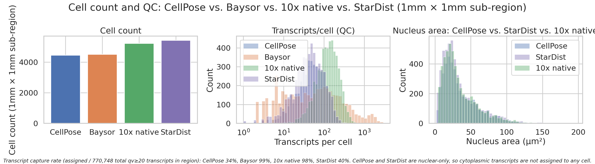

Nuclear-only methods capture 35–52% of transcripts; Mesmer's larger nuclear masks recover more without leaving nuclear-only mode. Voronoi variants capture 100% by construction. Baysor and 10x native both approach 99%.

---

## Q2: Do methods agree on cell-type identity for matched cells?

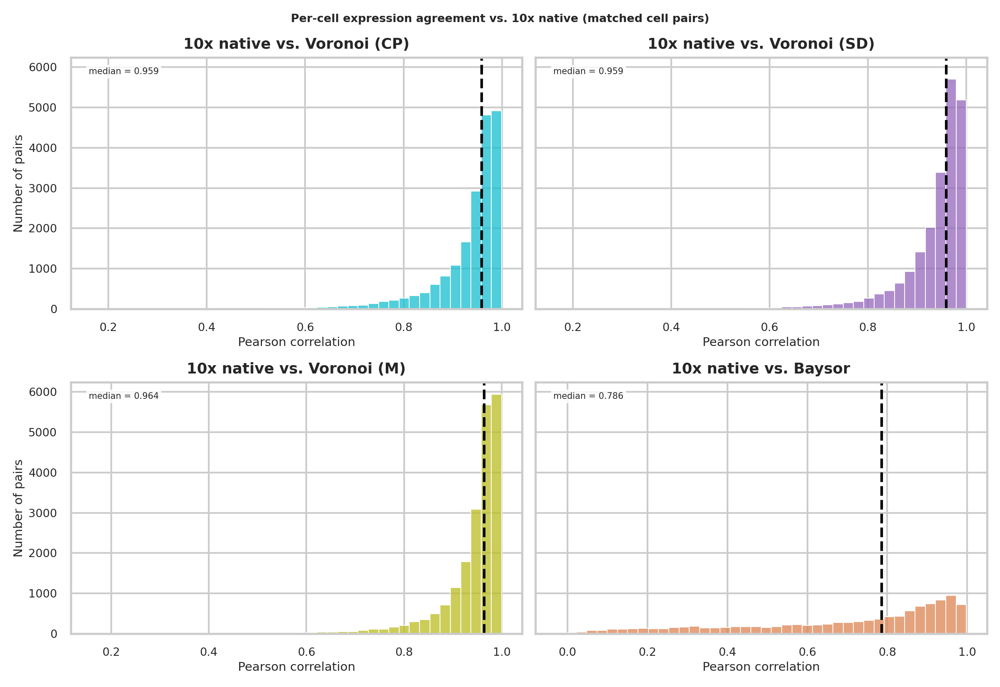

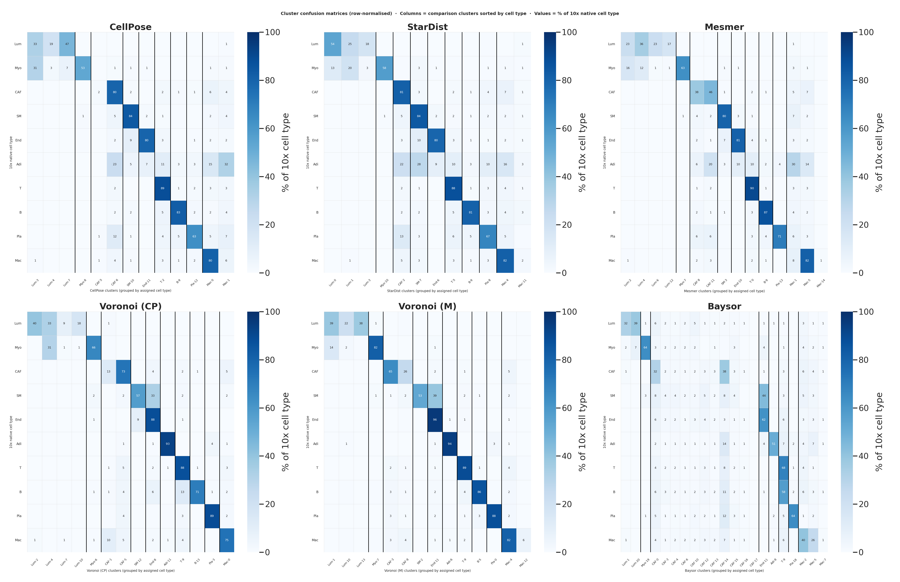

Per-cell expression correlation is high for all methods (median 0.79–0.96), but cluster-label agreement tells a different story. Nuclear methods (ARI ~0.55) and Voronoi methods (ARI 0.63–0.69) disagree with 10x native on roughly 20–34% of matched cells; Baysor disagrees on more than half. The confusion matrices show rows (10x native cell types) grouped along the diagonal for nuclear and Voronoi methods, with Baysor showing broader scatter — particularly in macrophage-rich and luminal epithelial regions.

---

## Q3: What drives the ARI gap — transcript coverage or nuclear detection quality?

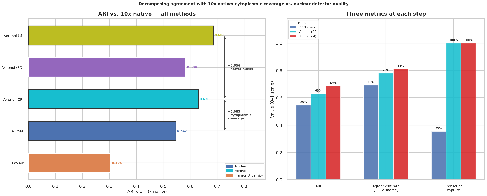

The two Voronoi controls make this a clean experiment. CellPose nuclear and Voronoi (CellPose) segment identical cells from identical centroids — the only change is that Voronoi assigns all transcripts to the nearest centroid rather than counting only those inside the nuclear mask. That single change adds **+0.083 ARI** (0.547 → 0.630). Swapping in Mesmer's higher-quality nuclear centroids while keeping the same Voronoi assignment adds another **+0.056 ARI** (0.630 → 0.686). Cytoplasmic transcript coverage is the larger contributor; nuclear centroid quality is a meaningful but secondary effect. The nucleus expansion controls (Supplemental) confirm this: morphological dilation of CellPose masks reaches 0.592 at 20µm but never matches Voronoi's 0.630, which assigns all transcripts without a fixed radius.

---

## Q4: Where in the tissue do methods disagree?

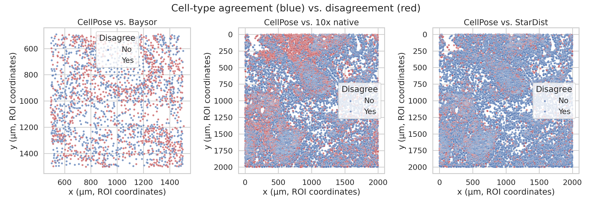

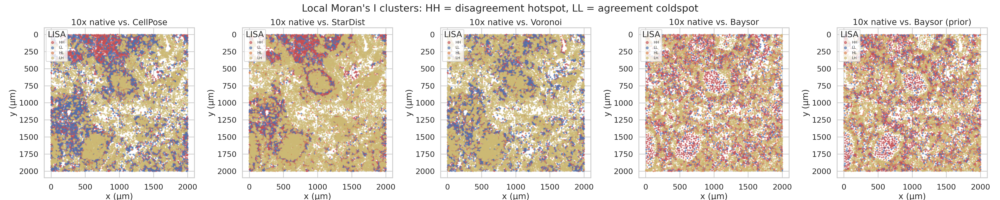

| Comparison | Global Moran's I | HH hotspots | LL coldspots |
| --- | --- | --- | --- |
| 10x native vs. CellPose | 0.178 | 21.7% | 30.3% |
| 10x native vs. StarDist | 0.215 | 18.6% | 15.0% |
| 10x native vs. Mesmer | 0.090 | 17.1% | 32.5% |
| 10x native vs. Voronoi (CP) | 0.076 | 11.1% | 27.2% |
| 10x native vs. Voronoi (M) | 0.161 | 9.5% | 20.4% |
| 10x native vs. Baysor | 0.033 | 21.4% | 17.5% |

Nuclear and Voronoi method disagreements are spatially structured (Moran's I 0.076–0.215), concentrated in the luminal epithelial territory visible in the top-left of each spatial map. Mesmer has the most agreement coldspots (32.5% LL) — large contiguous regions of identical cell-type calls. Voronoi (Mesmer) has the fewest disagreement hotspots (9.5% HH), consistent with residual errors being diffuse boundary noise rather than concentrated failure zones. Baysor's near-zero Moran's I (0.033) and roughly equal HH/LL split confirm its disagreement is spatially near-random — a different pattern entirely from the nuclear methods.

---

## Q5: Which cell types are most sensitive to segmentation choice?

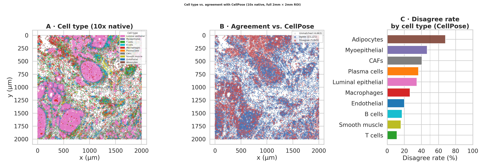

Adipocytes and myoepithelial cells carry the highest per-cell disagreement rates (~50–68% and ~40–47% across nuclear methods), but as rare populations they contribute modestly in absolute terms. Luminal epithelial cells are the dominant contributor by volume: ~35% per-cell disagreement across ~8,500 cells (~37% of all 10x-native cells) accounts for the majority of total disagreement events across every nuclear method. In this invasive ductal carcinoma tissue the luminal epithelial Leiden clusters at resolution 1.0 likely encompass malignant cells alongside residual normal epithelial — both share canonical markers (GATA3, PGR, ESR1, MUC1) and are not separable by nuclear morphology alone, where cytoplasmic transcripts carry the most discriminative signal. T cells and B cells are robustly identified regardless of method (CD3E, TRAC, MS4A1).

---

## Q6: Is disagreement cell-state-dependent or geometric?

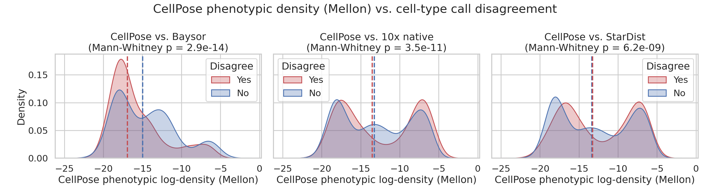

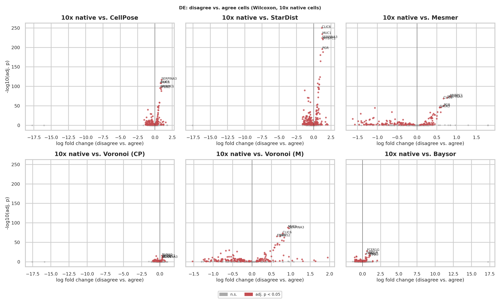

| Comparison | n agree / disagree | Median log-density (agree / disagree) | p |
| --- | --- | --- | --- |
| 10x native vs. CellPose | 13,121 / 5,845 | -21.31 / -20.78 | 2.9e-28 |
| 10x native vs. StarDist | 14,254 / 7,175 | -21.87 / -20.63 | 1.1e-90 |
| 10x native vs. Mesmer | 14,850 / 5,745 | -21.73 / -20.14 | 3.8e-79 |
| 10x native vs. Voronoi (CP) | 14,805 / 4,161 | -21.05 / -21.35 | 0.191 n.s. |
| 10x native vs. Voronoi (M) | 16,720 / 3,875 | -21.38 / -20.68 | 3.2e-12 |
| 10x native vs. Baysor | 5,286 / 5,667 | -22.76 / -22.75 | 0.756 n.s. |

Nuclear methods disagree on cells in higher-density phenotypic regions (Mann-Whitney p ≪ 0.001), and the DE volcano confirms the signal: disagreeing cells are enriched for luminal epithelial markers (MYBPC1, SERPINA3, CLIC6, PGR, GATA3, MUC1) — cytoplasmic transcripts underrepresented in nuclear-only masks. Voronoi (CellPose)'s disagreement is density-neutral (p = 0.19) with few significant DE genes, indicating residual error is geometric rather than cell-state-driven. Baysor's disagreement is also density-neutral but enriched for macrophage markers (CD14, MRC1, CD163), suggesting its transcript-density boundaries partition macrophage-rich regions differently from the morphology-based reference.

---

## Q7: Does segmentation alter the shape of the phenotypic landscape?

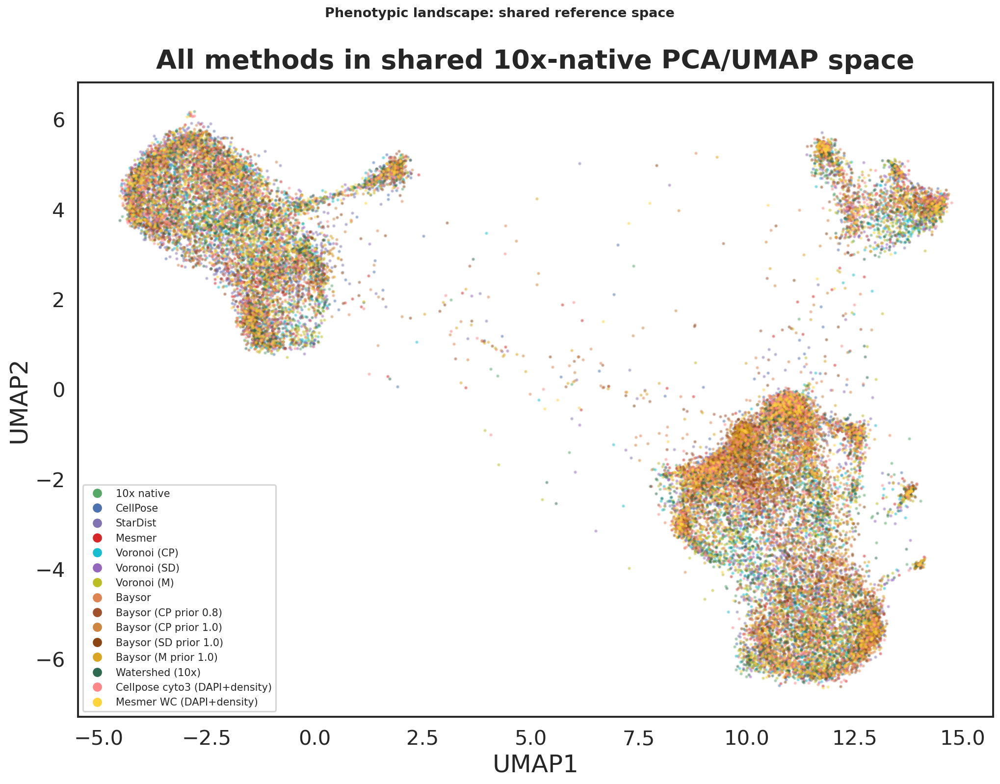

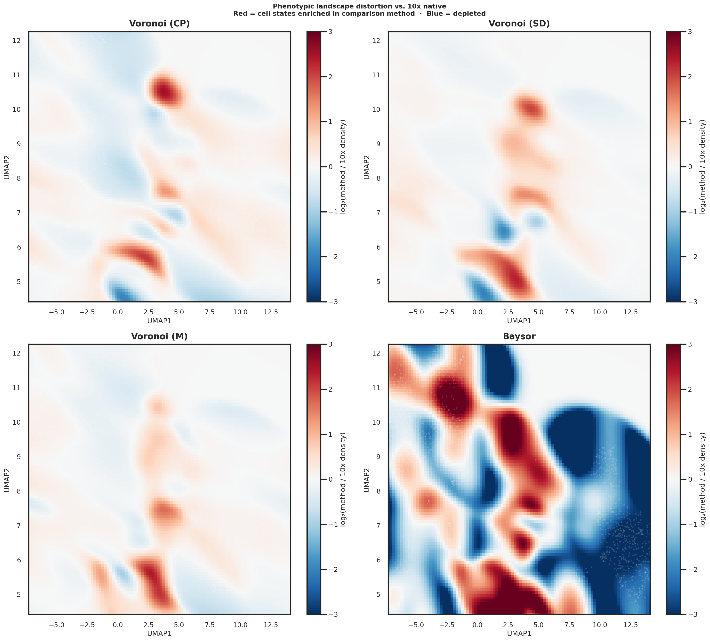

All methods are projected into a shared PCA space fit on the 10x-native reference (30 PCs, 55% variance explained), then embedded in a joint UMAP. The density ratio maps (log₂ method/10x) show which regions of phenotypic state space each method enriches or depletes. Nuclear methods show blue (depleted) regions concentrated in high-density luminal epithelial areas — consistent with missed cytoplasmic transcripts shifting those cells toward lower-expression states in PCA space. Voronoi methods track 10x native closely across most of state space. Baysor shows enrichment in a distinct region corresponding to its 21-cluster resolution of macrophage and stromal subtypes.

---

## Q8: Are these findings stable across clustering resolutions?

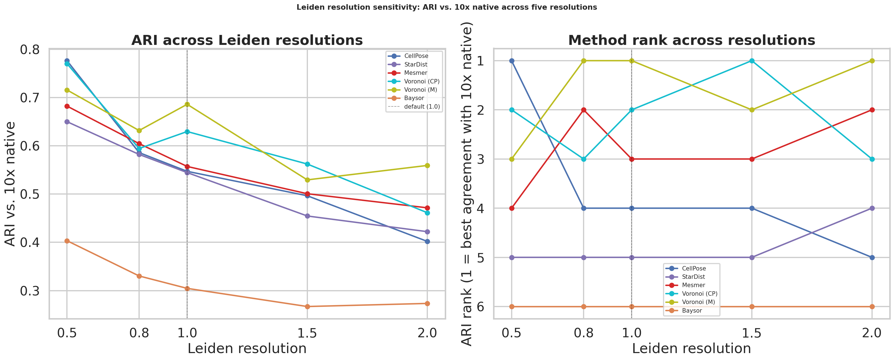

The method ordering is stable across Leiden resolutions 0.5–2.0. Voronoi (Mesmer) leads at resolutions 0.8 and above; Baysor is consistently lowest. At resolution 0.5 (9 clusters, very coarse) CellPose nuclear briefly edges Voronoi (Mesmer) because the luminal epithelial population collapses into a single large cluster that aligns well with nuclear boundaries alone. The Voronoi advantage grows with resolution, consistent with cytoplasmic transcripts becoming more important for distinguishing finer cell-state distinctions.

---

## Repo layout

```text
segmentation-benchmark/
├── environment.yml          # conda env (CellPose, Scanpy, Squidpy, SpatialData, ...)
├── data/
│   ├── raw/                 # downloaded Xenium bundle (gitignored)
│   └── processed/           # cropped ROI + derived files (gitignored)
├── notebooks/
├── src/segbench/
│   ├── io.py                # load Xenium bundle, ROI cropping
│   ├── segmentation/        # per-method wrappers
│   ├── quantify.py          # transcript aggregation -> per-cell AnnData
│   ├── compare.py           # cross-method comparison metrics
│   └── spatial.py           # spatial structure of disagreement
├── scripts/                 # CLI entry points
├── results/{figures,tables}/
└── tests/
```

## Environment setup

This project uses three toolchains: a main conda env for CellPose + Scanpy/Squidpy/SpatialData, a separate env for StarDist (TensorFlow-based), and Julia for Baysor. Mesmer runs via Docker.

### 1. Main env

```bash
conda env create -f environment.yml
conda activate segbench
```

### 2. StarDist

```bash
conda create -n stardist python=3.10
conda run -n stardist pip install stardist tensorflow-cpu
```

### 3. Mesmer (DeepCell)

```bash
docker pull vanvalenlab/deepcell-applications:latest
```

The image bundles pretrained model weights and does not require a `DEEPCELL_ACCESS_TOKEN`. See [`scripts/run_mesmer.sh`](scripts/run_mesmer.sh).

### 4. Julia + Baysor

```bash
juliaup add 1.10
julia +1.10 -e 'using Pkg; Pkg.add(PackageSpec(url="https://github.com/kharchenkolab/Baysor.git", rev="v0.7.1")); Pkg.build("Baysor")'
```

See [`scripts/run_baysor.sh`](scripts/run_baysor.sh).

---

## Supplemental

### Per-method Leiden clustering (UMAP)

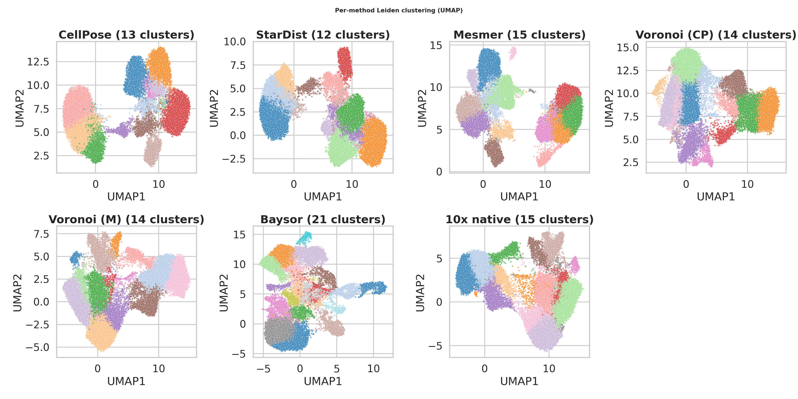

Leiden clustering runs independently on each method's cells; cluster counts vary (CellPose 13, StarDist 12, Mesmer 15, Voronoi (CP) 14, Voronoi (M) 14, Baysor 21, 10x native 15). Baysor's higher count reflects richer per-cell transcript profiles resolving finer expression differences at resolution 1.0.

### Cell type annotation (10x native)

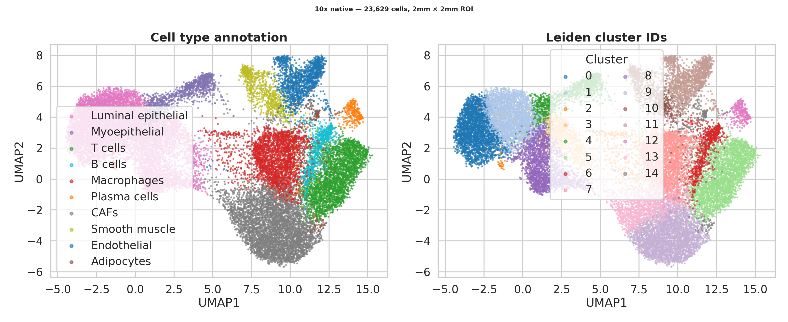

15 Leiden clusters manually annotated into 10 cell types based on top Wilcoxon marker genes. Clusters 0, 1, 3, 8 are luminal epithelial subtypes grouped under a single label; clusters 2 and 7 are distinct macrophage populations. See [`scripts/annotate_clusters.py`](scripts/annotate_clusters.py) for the full annotation.

### Baysor with CellPose nucleus prior

Baysor run with `--prior-segmentation` from CellPose masks at `prior_segmentation_confidence=0.2`. The prior adds ~5% matched pairs and marginally improves ARI (0.305 → 0.318) but leaves the fundamental disagreement pattern unchanged: 51.9% disagreement, Moran's I 0.036, near-random spatial structure.

| Metric | Baysor | Baysor (CellPose prior) |
| --- | --- | --- |
| Matched pairs | 10,953 | 11,454 |
| Median corr | 0.786 | 0.798 |
| ARI | 0.305 | 0.318 |
| Disagreement rate | 51.7% | 51.9% |
| Moran's I | 0.033 | 0.036 |

### Nucleus expansion (10µm, 20µm)

CellPose masks expanded by 10µm and 20µm using `skimage.segmentation.expand_labels`. ARI improves monotonically (0.547 → 0.572 → 0.592) but never reaches Voronoi (0.630), which assigns all transcripts without a fixed radius.

### Baysor prior confidence sensitivity

| Config | ARI | Cells |
| --- | --- | --- |
| Baysor (prior, c=0.2) | 0.318 | 19,061 |
| Baysor (prior, c=0.5) | 0.395 | — |
| Baysor (prior, c=0.8) | 0.488 | 29,771 |

c=0.8 inflates cell count to 29,771 — likely an artefact of the prior overriding Baysor's boundary inference at high confidence.
