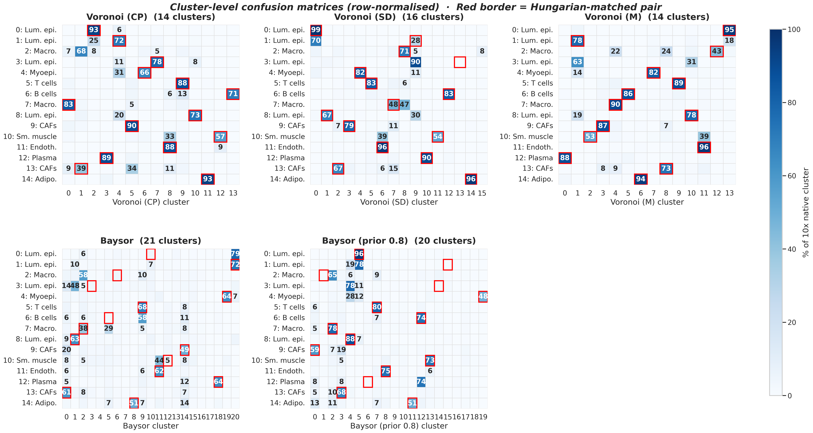
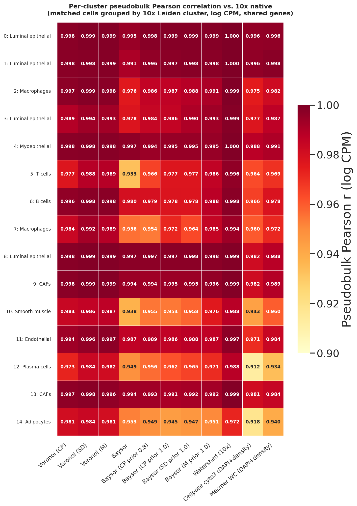
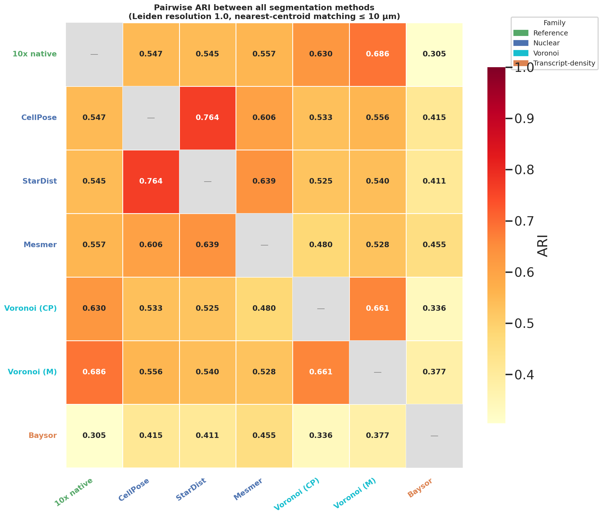
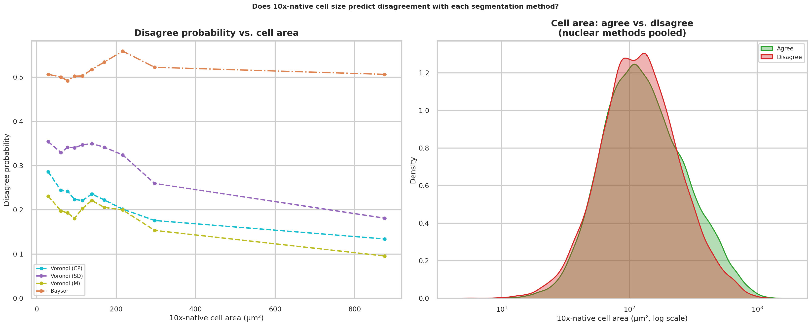
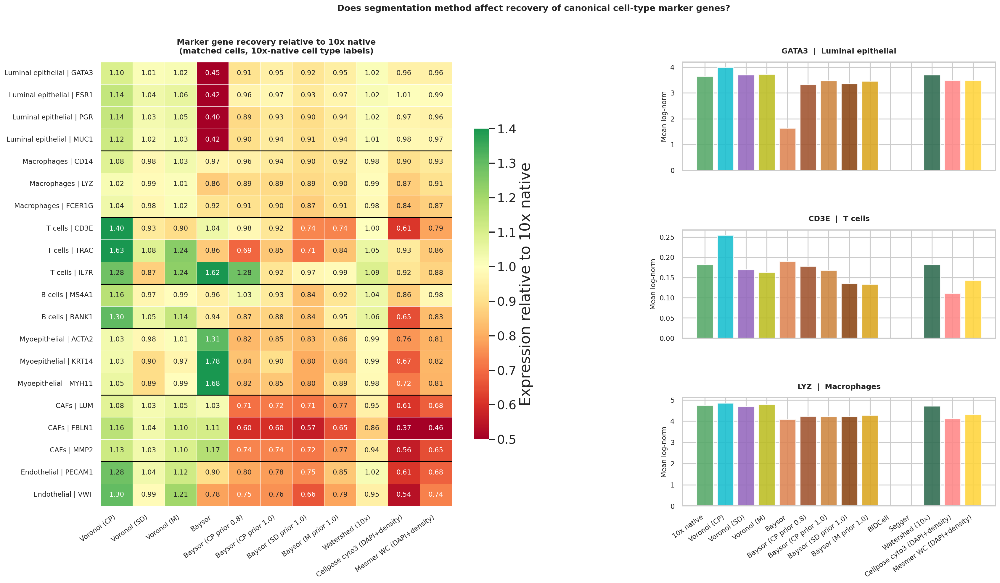
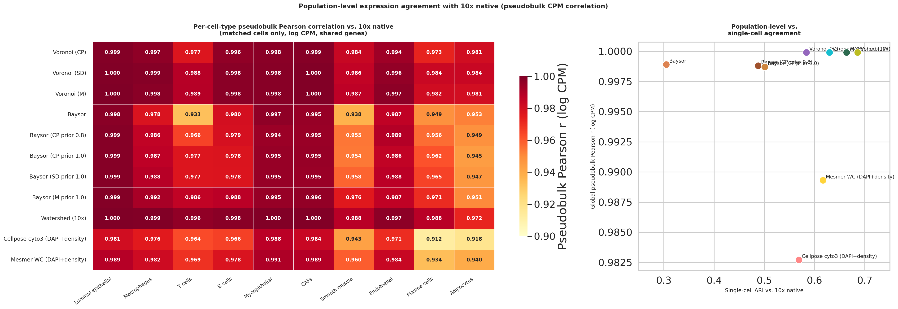

# Segmentation Benchmarking on Xenium Spatial Transcriptomics Data

**Question:** Do nuclear-mask (CellPose, StarDist, Mesmer), Voronoi, and transcript-density (Baysor) segmentation methods transfer well to Xenium spatial transcriptomics, and does method choice meaningfully change downstream cell-type calls?

## Summary

| Comparison | Matched pairs | Median corr | ARI | Disagreement rate | Moran's I |
| --- | ---: | ---: | ---: | ---: | ---: |
| 10x native vs. CellPose | 18,966 | 0.822 | 0.547 | 30.8% | 0.178 |
| 10x native vs. StarDist | 21,429 | 0.826 | 0.545 | 33.5% | 0.215 |
| 10x native vs. Mesmer | 20,595 | 0.879 | 0.557 | 27.9% | 0.090 |
| 10x native vs. Voronoi (CP) | 18,966 | 0.959 | 0.630 | 21.9% | 0.076 |
| 10x native vs. Voronoi (SD) | 21,428 | 0.959 | 0.584 | 31.9% | 0.194 |
| 10x native vs. Voronoi (M) | 20,595 | 0.964 | 0.686 | 18.8% | 0.161 |
| 10x native vs. Baysor | 10,953 | 0.786 | 0.305 | 51.7% | 0.033 |
| 10x native vs. Baysor (CP prior 0.2) | 11,454 | 0.798 | 0.318 | 51.9% | 0.036 |
| 10x native vs. Baysor (CP prior 0.8) | 20,108 | 0.884 | 0.488 | 38.8% | 0.219 |
| 10x native vs. Baysor (CP prior 1.0) | 20,308 | 0.902 | 0.501 | 33.8% | 0.111 |

*Matched pairs*: nearest-centroid matching. *Median corr*: per-pair Pearson correlation of log-normalised expression. *ARI*: Adjusted Rand Index after Hungarian cluster alignment (0 = random, 1 = perfect). *Moran's I*: spatial autocorrelation of the disagree flag.

Three method families emerge clearly, with a fourth hybrid family introduced by the Baysor prior variants. Nuclear methods (CellPose, StarDist, Mesmer) cluster at ARI ~0.55 with spatially structured disagreement concentrated in the luminal epithelial population. Voronoi variants reach ARI 0.63–0.69 with 100% transcript capture. Baysor without a prior reaches ARI 0.31 with near-random spatial disagreement. Adding a strong CellPose nuclear prior (PSC 0.8–1.0) lifts Baysor to ARI 0.49–0.50 — still below Voronoi, but with the lowest negative marker violation rate of any expansion method (0.31 per 1000 transcripts vs. 0.37–0.43 for Voronoi), indicating that density-adaptive expansion produces fewer cross-lineage boundary artifacts even when it agrees less with 10x native's cell calls.

Nuclear methods capture too few transcripts for meaningful downstream comparison and are excluded from figures past the recovery section. Their metrics are retained in all tables.

<!-- Project 2 (label-transfer-benchmark): uses this project's segmented cells to evaluate scRNA-seq label-transfer reliability. Add link once repo is public. -->

## Dataset

**Xenium FFPE Human Breast (Custom Add-on Panel)**, Janesick et al. 2023, *Nature Communications* ([dataset page](https://www.10xgenomics.com/datasets/xenium-ffpe-human-breast-with-custom-add-on-panel-1-standard)). Invasive ductal carcinoma; matched scRNA-seq + Visium from the same tissue blocks: GEO [GSE243275](https://www.ncbi.nlm.nih.gov/geo/query/acc.cgi?acc=GSE243275).

All analysis runs on a 2mm × 2mm ROI (~23,600 cells, ~3.4M transcripts, 380-gene panel) with a mix of tumor, stroma, and immune-infiltrated regions. See [`docs/dataset.md`](docs/dataset.md) for download and ROI details.

## Methods

| Method | Input | Notes |
| --- | --- | --- |
| **10x native** | provided | Xenium Ranger's full segmentation (nuclear detection + proprietary expansion); used as reference anchor. The expansion algorithm is closed-source. |
| **10x Ranger** | DAPI | The nuclear detection component of Xenium Ranger, extracted from `nucleus_boundaries.parquet` and rasterized into a label mask. Included alongside CellPose/StarDist/Mesmer as a fourth nuclear detector to test whether 10x's purpose-built detector outperforms general-purpose models. |
| **CellPose** | DAPI | CellPose 3.x `nuclei` model, CPU |
| **StarDist** | DAPI | `2D_versatile_fluo` model, separate `stardist` env |
| **Mesmer** | DAPI | DeepCell via Docker; image bundles model weights |
| **Voronoi (CP / SD / M / 10x)** | nuclear centroids | Nearest-centroid transcript assignment using CellPose, StarDist, Mesmer, or 10x Ranger centroids; 100% transcript capture by construction |
| **Baysor** | transcripts | Transcript-density EM (no prior), Julia 1.10, 4 tiles |
| **Baysor (prior 0.2 / 0.8 / 1.0)** | transcripts + nuclear masks | Baysor with `prior_segmentation_confidence` controlling the blend between density model and nuclear prior. At PSC 1.0, nuclear transcripts are hard-locked and only cytoplasmic transcripts use density-adaptive expansion. Tested with all four nuclear detectors at PSC 1.0 to isolate detector quality from expansion strategy. |

Nuclear-only methods (CellPose, StarDist, Mesmer, 10x Ranger) capture only 35–52% of transcripts and are included in the cell/transcript recovery section but excluded from downstream figures because their low transcript capture dominates any comparison. Cells are matched by nearest centroid across methods. Leiden clustering runs independently on each method's cells; cluster labels are aligned via Hungarian algorithm before computing ARI and disagreement rate.

---

## Cell and transcript recovery

| Method | Cells | Median tx/cell | Transcript capture |
| --- | ---: | ---: | ---: |
| 10x native | 23,629 | 124 | 99.0% |
| CellPose | 20,166 | 49 | 35.4% |
| StarDist | 24,745 | 45 | 40.8% |
| Mesmer | 21,697 | 70 | 51.8% |
| Voronoi (CP) | 20,166 | 149 | 100% |
| Voronoi (SD) | 24,745 | 122 | 100% |
| Voronoi (M) | 21,697 | 142 | 100% |
| Baysor | 18,321 | 53 | 98.6% |
| Baysor (CP prior 0.2) | 19,061 | 53 | 98.7% |
| Baysor (CP prior 0.8) | 29,771 | 67 | 99% |
| Baysor (CP prior 1.0) | 30,473 | 69 | 99% |


Nuclear-only methods capture 35–52% of transcripts; Mesmer's larger nuclear masks recover more without leaving nuclear-only mode. Voronoi variants capture 100% by construction. Baysor without a prior captures 98.6% but detects fewer cells (18,321). Adding a strong CellPose nuclear prior (PSC 0.8 or 1.0) increases cell count to ~30,000 — more than any other method — because the fixed nuclear seeds prevent Baysor from merging adjacent cells. Median transcripts per cell for the prior variants (67–69) falls between nuclear-only methods and Voronoi, reflecting the density-adaptive expansion that captures cytoplasmic transcripts without the geometric completeness of Voronoi assignment.

---

## Clustering comparison

Leiden clustering runs independently on each method's cells (normalize → PCA → neighbors → Leiden at resolution 1.0). Cluster labels are aligned across methods via Hungarian algorithm before computing confusion matrices and disagreement.

| Method | Clusters | Cells | Median cells/cluster | Min | Max |
| --- | --- | --- | --- | --- | --- |
| 10x native | 15 | 23,629 | 1,333 | 199 | 3,314 |
| CellPose | 13 | 20,166 | 1,080 | 105 | 3,658 |
| StarDist | 12 | 24,745 | 1,512 | 457 | 4,771 |
| Mesmer | 15 | 21,697 | 1,400 | 32 | 2,906 |
| Voronoi (CP) | 14 | 20,166 | 1,134 | 213 | 3,092 |
| Voronoi (SD) | 16 | 24,743 | 1,394 | 24 | 5,000 |
| Voronoi (M) | 14 | 21,697 | 1,557 | 192 | 3,262 |
| Baysor | 21 | 18,321 | 609 | 86 | 3,070 |

Morphological methods and 10x native converge on 12–15 clusters with median sizes above 1,000 cells. Baysor produces 21 clusters with a median of 609 — smaller, more fragmented populations consistent with over-segmentation rather than finer biological resolution (its ARI of 0.31 and near-random spatial disagreement support this; see resolution stability below).


### Cluster alignment



The raw Leiden cluster cross-tabulations show how each method's clusters map onto 10x native's 15. Each row is one 10x native cluster; columns are the comparison method's clusters; red borders mark the Hungarian-matched (optimal 1-to-1) pair. Morphological methods produce clean matches — the dominant cell in each row aligns with the Hungarian pair, and off-diagonal leakage is minimal. Baysor's 15×21 matrix is qualitatively different: signal disperses across many columns, matched pairs often capture a minority of cells, and 6 clusters have no 10x counterpart. Collapsing to annotated cell types, the same pattern holds — Baysor shows broader scatter particularly in macrophage and luminal epithelial populations.


Per-cell expression correlation is high for all methods (median 0.79–0.96), but cluster-label agreement tells a different story. Nuclear methods (ARI ~0.55) and Voronoi methods (ARI 0.63–0.69) disagree with 10x native on roughly 20–34% of matched cells; Baysor disagrees on more than half.

### Per-cluster pseudobulk



To test whether cluster-level expression profiles agree, matched cells are grouped by 10x native's 15 Leiden clusters and pseudobulked per method. Nuclear methods drop to r = 0.86–0.87 on luminal epithelial clusters (0, 1, 3, 8) — the same populations driving single-cell disagreement — while Voronoi variants stay above 0.99 across all clusters. Baysor shows a comparable luminal dip plus reduced correlation on macrophage clusters (2, 7), consistent with transcript-density boundaries partitioning those populations differently.

### Resolution stability


The method ordering is stable across Leiden resolutions 0.5–2.0. Voronoi (Mesmer) leads at resolutions 0.8 and above; Baysor is consistently lowest. At resolution 0.5 (9 clusters) CellPose briefly edges Voronoi (Mesmer) because the luminal epithelial population collapses into a single large cluster that aligns well with nuclear boundaries alone. The Moran's I panel confirms that the spatial-structure gap is resolution-invariant: morphological methods maintain I = 0.2–0.6 (spatially structured disagreement) while Baysor stays near zero (0.004–0.065) regardless of cluster granularity.

---

## Spatial structure of disagreement


| Comparison | Global Moran's I | HH hotspots | LL coldspots |
| --- | --- | --- | --- |
| 10x native vs. CellPose | 0.178 | 21.7% | 30.3% |
| 10x native vs. StarDist | 0.215 | 18.6% | 15.0% |
| 10x native vs. Mesmer | 0.090 | 17.1% | 32.5% |
| 10x native vs. Voronoi (CP) | 0.076 | 11.1% | 27.2% |
| 10x native vs. Voronoi (SD) | 0.194 | 23.2% | 30.8% |
| 10x native vs. Voronoi (M) | 0.161 | 9.5% | 20.4% |
| 10x native vs. Baysor | 0.033 | 21.4% | 17.5% |

Nuclear and Voronoi disagreements are spatially structured (Moran's I 0.076–0.215), concentrated in luminal epithelial territory. Mesmer has the most agreement coldspots (32.5% LL); Voronoi (Mesmer) has the fewest disagreement hotspots (9.5% HH), consistent with residual errors being diffuse boundary noise. Baysor's near-zero Moran's I (0.033) and equal HH/LL split confirm spatially near-random disagreement, unlike the nuclear methods.

*LISA labels*: HH = disagreement hotspot; LL = agreement coldspot. Global Moran's I summarises spatial autocorrelation of the disagree flag (0 = random, 1 = fully clustered).

---

## Cell-type sensitivity


Adipocytes and myoepithelial cells have the highest per-cell disagreement (~50–68% and ~40–47%) but are rare. Luminal epithelial cells dominate by volume: ~35% disagreement across ~8,500 cells drives the majority of total disagreement events. These clusters likely encompass malignant and normal epithelial cells; both share canonical markers (GATA3, PGR, ESR1, MUC1) and are inseparable by nuclear morphology alone. T cells and B cells are robustly identified regardless of method.

---

## Disagreement drivers: cell state vs. geometry


| Comparison | n agree / disagree | Median log-density (agree / disagree) | p |
| --- | --- | --- | --- |
| 10x native vs. CellPose | 13,121 / 5,845 | -21.31 / -20.78 | 2.9e-28 |
| 10x native vs. StarDist | 14,254 / 7,175 | -21.87 / -20.63 | 1.1e-90 |
| 10x native vs. Mesmer | 14,850 / 5,745 | -21.73 / -20.14 | 3.8e-79 |
| 10x native vs. Voronoi (CP) | 14,805 / 4,161 | -21.05 / -21.35 | 0.191 n.s. |
| 10x native vs. Voronoi (SD) | 14,597 / 6,831 | -21.74 / -20.56 | 5.5e-51 |
| 10x native vs. Voronoi (M) | 16,720 / 3,875 | -21.38 / -20.68 | 3.2e-12 |
| 10x native vs. Baysor | 5,286 / 5,667 | -22.76 / -22.75 | 0.756 n.s. |

Nuclear methods disagree on cells in higher-density phenotypic regions (Mann-Whitney p ≪ 0.001). The DE volcano confirms this: disagreeing cells are enriched for luminal epithelial markers (MYBPC1, SERPINA3, CLIC6, PGR, GATA3, MUC1), cytoplasmic transcripts underrepresented in nuclear-only masks. Voronoi (CellPose) disagreement is density-neutral (p = 0.19) with few DE genes, indicating residual errors are geometric. Baysor disagreement is also density-neutral but enriched for macrophage markers (CD14, MRC1, CD163), consistent with transcript-density boundaries partitioning macrophage-rich regions differently.

---

## Phenotypic landscape distortion


All methods are projected into a shared PCA space fit on 10x native (30 PCs, 55% variance explained) and embedded in a joint UMAP. Density ratio maps (log₂ method/10x) show which phenotypic regions each method enriches or depletes. Nuclear methods show depleted regions in high-density luminal epithelial areas, consistent with missed cytoplasmic transcripts pulling cells toward lower-expression PCA states. Voronoi methods track 10x native closely. Baysor shows enrichment in a distinct region corresponding to its finer resolution of macrophage and stromal subtypes.

---

## Pairwise method agreement



| | 10x native | CellPose | StarDist | Mesmer | Voronoi (CP) | Voronoi (SD) | Voronoi (M) | Baysor |
| --- | --- | --- | --- | --- | --- | --- | --- | --- |
| **10x native** | 1.0 | 0.547 | 0.545 | 0.557 | 0.630 | 0.584 | 0.686 | 0.305 |
| **CellPose** | | 1.0 | 0.764 | 0.606 | 0.533 | 0.557 | 0.556 | 0.415 |
| **StarDist** | | | 1.0 | 0.639 | 0.525 | 0.568 | 0.540 | 0.411 |
| **Mesmer** | | | | 1.0 | 0.480 | 0.535 | 0.528 | 0.455 |
| **Voronoi (CP)** | | | | | 1.0 | 0.581 | 0.661 | 0.336 |
| **Voronoi (SD)** | | | | | | 1.0 | 0.633 | 0.361 |
| **Voronoi (M)** | | | | | | | 1.0 | 0.377 |

No, at least not within the Voronoi family. CellPose and StarDist agree with each other at ARI 0.764 (higher than the Voronoi pair at 0.661) because both are nuclear-morphology methods on the same DAPI image. Switching to Voronoi assignment lowers within-paradigm agreement because the two Voronoi variants use different centroids, shifting boundaries even where centroids are close. What Voronoi does raise is agreement with the 10x-native whole-cell reference (0.63–0.69): compatibility with the platform's own segmentation, not cross-method reproducibility. Baysor remains isolated from all morphological methods (ARI 0.30–0.46 regardless of partner).

---

## Cell size and disagreement



| Comparison | Median area (agree) | Median area (disagree) | p |
| --- | --- | --- | --- |
| 10x native vs. CellPose | 123.9 µm² | 121.4 µm² | 7.2e-07 |
| 10x native vs. StarDist | 121.2 µm² | 116.9 µm² | 2.4e-12 |
| 10x native vs. Mesmer | 126.2 µm² | 119.1 µm² | 3.2e-07 |
| 10x native vs. Voronoi (CP) | 126.8 µm² | 111.5 µm² | 4.9e-32 |
| 10x native vs. Voronoi (SD) | 123.8 µm² | 112.4 µm² | 8.8e-29 |
| 10x native vs. Voronoi (M) | 125.9 µm² | 117.7 µm² | 3.7e-19 |
| 10x native vs. Baysor | 167.0 µm² | 173.4 µm² | 0.28 n.s. |

Smaller 10x-native cells are significantly more likely to disagree with every morphological method (p ≪ 0.001). The direction is counter-intuitive: larger cells have more cytoplasm, yet it is smaller cells that disagree more. The pattern holds for Voronoi methods too, ruling out transcript capture as the cause. Smaller cells likely correspond to densely packed regions where any method's cluster assignment is noisier. Baysor shows no size dependence (p = 0.28); its boundaries are insensitive to morphologically defined cell area.

---

## Marker gene recovery



Using 10x-native cell-type annotations as ground truth, nuclear methods recover 75–92% of cytoplasmic marker expression relative to 10x native, with the largest deficits for extranuclear markers like MUC1, SERPINA3, and LYZ. Voronoi methods recover near-100% across all cell types. Baysor recovers macrophage markers (LYZ, CD14) at or above 10x-native levels while showing slightly reduced T cell marker (CD3E) recovery.

---

## Population-level convergence



| Method | Per-cell-type pseudobulk r (range) | Aggregate r | Single-cell ARI |
| --- | --- | --- | --- |
| CellPose | 0.87–0.98 | 0.970 | 0.547 |
| StarDist | 0.88–0.99 | 0.975 | 0.545 |
| Mesmer | 0.92–0.99 | 0.983 | 0.557 |
| Voronoi (CP) | 0.98–1.00 | 0.9999 | 0.630 |
| Voronoi (SD) | 0.98–1.00 | 0.9999 | 0.584 |
| Voronoi (M) | 0.98–1.00 | 0.9999 | 0.686 |
| Baysor | 0.94–1.00 | 0.999 | 0.305 |

Pseudobulk is computed within each of 10 annotated cell types (not as a whole-ROI sum), so the correlation tests whether each method's cell-type compartments recover the same expression programs as 10x native. Baysor's per-cell-type correlations range from 0.94 (plasma cells) to 0.997 (CAFs), degrading predictably on rare populations with fewer cells. Despite its low single-cell ARI of 0.305, Baysor is competitive with nuclear methods at the cell-type level — its aggregate r of 0.999 sits above CellPose (0.970) and StarDist (0.975). Nuclear methods show reduced pseudobulk r (0.97–0.98) because missing cytoplasmic transcripts suppress marker signal systematically across all cells of a type. Voronoi methods achieve both high single-cell ARI and near-perfect pseudobulk agreement.

---

## Repo layout

```text
segmentation-benchmark/
├── environment.yml          # conda env (CellPose, Scanpy, Squidpy, SpatialData, ...)
├── data/
│   ├── raw/                 # downloaded Xenium bundle (gitignored)
│   └── processed/           # cropped ROI + derived files (gitignored)
├── notebooks/
├── src/segbench/
│   ├── constants.py         # method metadata, cell-type annotations, negative marker pairs
│   ├── io.py                # load Xenium bundle, ROI cropping
│   ├── segmentation/        # per-method wrappers (CellPose, StarDist, Mesmer, Baysor)
│   ├── quantify.py          # transcript aggregation -> per-cell AnnData
│   ├── compare.py           # cross-method comparison metrics
│   ├── spatial.py           # spatial structure of disagreement
│   └── style.py             # shared matplotlib theme
├── scripts/                 # CLI entry points
├── results/{figures,tables}/
└── tests/
```

## Environment setup

This project uses three toolchains: a main conda env for CellPose + Scanpy/Squidpy/SpatialData, a separate env for StarDist (TensorFlow-based), and Julia for Baysor. Mesmer runs via Docker.

### 1. Main env

```bash
conda env create -f environment.yml
conda activate segbench
```

### 2. StarDist

```bash
conda create -n stardist python=3.10
conda run -n stardist pip install stardist tensorflow-cpu
```

### 3. Mesmer (DeepCell)

```bash
docker pull vanvalenlab/deepcell-applications:latest
```

The image bundles pretrained model weights and does not require a `DEEPCELL_ACCESS_TOKEN`. See [`scripts/run_mesmer.sh`](scripts/run_mesmer.sh).

### 4. Julia + Baysor

```bash
juliaup add 1.10
julia +1.10 -e 'using Pkg; Pkg.add(PackageSpec(url="https://github.com/kharchenkolab/Baysor.git", rev="v0.7.1")); Pkg.build("Baysor")'
```

See [`scripts/run_baysor.sh`](scripts/run_baysor.sh).

---

## Supplemental

### Cell type annotation (10x native)


15 Leiden clusters manually annotated into 10 cell types based on top Wilcoxon marker genes. Clusters 0, 1, 3, 8 are luminal epithelial subtypes grouped under a single label; clusters 2 and 7 are distinct macrophage populations. See [`scripts/annotate_clusters.py`](scripts/annotate_clusters.py) for the full annotation.

### Baysor with CellPose nucleus prior

Baysor run with `--prior-segmentation` from CellPose masks at `prior_segmentation_confidence=0.2`. The prior adds ~5% matched pairs and marginally improves ARI (0.305 → 0.318) but leaves the fundamental disagreement pattern unchanged: 51.9% disagreement, Moran's I 0.036, near-random spatial structure.

| Metric | Baysor | Baysor (CellPose prior) |
| --- | --- | --- |
| Matched pairs | 10,953 | 11,454 |
| Median corr | 0.786 | 0.798 |
| ARI | 0.305 | 0.318 |
| Disagreement rate | 51.7% | 51.9% |
| Moran's I | 0.033 | 0.036 |

### Nucleus expansion (10µm, 20µm)

CellPose masks expanded by 10µm and 20µm using `skimage.segmentation.expand_labels`. ARI improves monotonically (0.547 → 0.572 → 0.592) but never reaches Voronoi (0.630), which assigns all transcripts without a fixed radius.

### Baysor prior confidence sensitivity

| Config | ARI | Cells |
| --- | --- | --- |
| Baysor (prior, c=0.2) | 0.318 | 19,061 |
| Baysor (prior, c=0.5) | 0.395 | - |
| Baysor (prior, c=0.8) | 0.488 | 29,771 |

c=0.8 inflates cell count to 29,771, likely an artefact of the prior overriding Baysor's boundary inference at high confidence.
