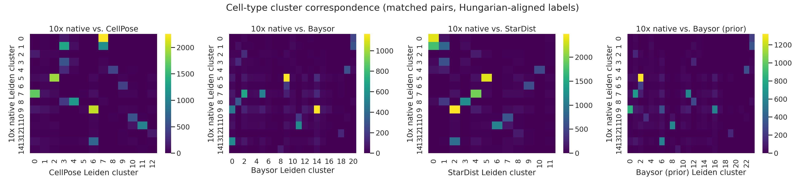

# Segmentation Benchmarking on Xenium Spatial Transcriptomics Data

**Question:** Do segmentation methods developed for multiplexed imaging (CellPose, StarDist) transfer well to imaging-based spatial transcriptomics (10x Xenium), and does method choice meaningfully change downstream cell-type calls?

## Key findings

| Comparison | Matched pairs | Median corr | ARI | Disagreement rate | Moran's I |
|---|---|---|---|---|---|
| 10x native vs. CellPose | 18,966 | 0.822 | 0.547 | 30.8% | 0.178 |
| 10x native vs. StarDist | 21,429 | 0.826 | 0.545 | 33.5% | 0.215 |
| 10x native vs. Baysor (prior) | 11,454 | 0.798 | 0.318 | 51.9% | 0.036 |
| 10x native vs. Baysor | 10,953 | 0.786 | 0.305 | 51.7% | 0.033 |

Nuclear methods (CellPose, StarDist) agree well with 10x native: ARI ~0.55, ~31-34% disagreement, Moran's I 0.178-0.215. Transcript-density methods (both Baysor runs) score markedly worse: ARI ~0.31, ~52% disagreement, Moran's I 0.033-0.036. Segmentation modality (nuclear pixel mask vs. transcript-density neighborhoods) dominates over algorithm choice within a modality. The higher Moran's I for nuclear methods means their disagreement with the 10x platform reference is spatially structured — concentrated in tissue regions where nuclear detection is harder — while Baysor disagreement is near-random across the tissue. Adding a CellPose-nucleus prior to Baysor increases matched pairs by ~5% and ARI marginally (0.305 → 0.318), confirming that nucleus detection is not the bottleneck. Cross-modality disagreement preferentially hits phenotypically rare cells (Mellon density analysis); same-modality comparisons show no comparable effect.

This is Project 1 of a portfolio bridging imaging-based spatial biology into sequencing-based bioinformatics. Project 2 ([label-transfer-benchmark](https://github.com/joemoore94/label-transfer-benchmark)) uses this project's segmented cells to evaluate scRNA-seq label-transfer reliability.

## Dataset

**Xenium FFPE Human Breast (Custom Add-on Panel)**, Janesick et al. 2023, *Nature Communications* ([dataset page](https://www.10xgenomics.com/datasets/xenium-ffpe-human-breast-with-custom-add-on-panel-1-standard)). ~577,000 cells, ~78M transcripts, registered post-Xenium H&E. Matched scRNA-seq + Visium from the same tissue blocks: GEO [GSE243275](https://www.ncbi.nlm.nih.gov/geo/query/acc.cgi?acc=GSE243275).

Segmentation runs on a ~2mm x 2mm ROI with a mix of tumor, stroma, and immune-infiltrated regions. See [`docs/dataset.md`](docs/dataset.md) for download and ROI details.

## Methods

| Method | Input | Notes |
|---|---|---|
| **10x native** | provided | Xenium Ranger's own segmentation, reshaped by `scripts/build_10x_adata.py` |
| **CellPose** | DAPI (2mm x 2mm ROI) | CellPose 3.x `nuclei` model, CPU |
| **StarDist** | DAPI (2mm x 2mm ROI) | `2D_versatile_fluo` model, separate `stardist` conda env |
| **Mesmer** (DeepCell) | DAPI | not run; deepcell.org account system non-functional as of June 2026; env and wrapper ready |
| **Baysor** | transcripts (2mm x 2mm, 4 tiles) | transcript-density EM, Julia 1.10 |
| **Baysor (CellPose prior)** | transcripts + CellPose nuclei (4 tiles) | Baysor with `--prior-segmentation` from CellPose masks, `prior_segmentation_confidence=0.2` |

Per-cell transcript aggregation → AnnData → cell counts, transcript capture, expression correlation, Leiden clustering, and spatial structure of disagreement (Moran's I, Mellon density). Independent Leiden runs assign arbitrary cluster IDs, so cluster labels are aligned across methods using the Hungarian algorithm (linear sum assignment on the confusion matrix) before computing disagreement rate and ARI.

## Results

### Cell counts and transcript capture

| | CellPose | Baysor | 10x native | StarDist | Baysor (prior) |
|---|---|---|---|---|---|
| Cells | 20,166 | 18,321 | 23,629 | 24,745 | 19,061 |
| Median transcripts/cell | 49 | 53 | 124 | 45 | 53 |
| Transcript capture | 35.4% | 98.6% | 99.0% | 40.8% | 98.7% |


Nuclear-only methods (CellPose, StarDist) capture 35-41% of transcripts because cytoplasmic transcripts fall outside nucleus masks; whole-cell and transcript-based methods capture ~99%. Median nucleus area is nearly identical across CellPose, StarDist, and 10x native (27-30 µm²).

### Clustering structure


All five methods produce well-separated UMAP clusters (12-24 Leiden clusters). Baysor variants produce more clusters (21-24) than nuclear methods (12-15), consistent with their higher per-cell transcript counts resolving finer expression differences.

### Pairwise comparisons (all vs. 10x native)





All four comparisons use 10x native (Xenium Ranger's own segmentation) as the reference anchor.

**10x native vs. CellPose** (whole-cell vs. nuclear): 18,966 matched pairs, median expression correlation 0.822, ARI 0.547, 30.8% disagreement, Moran's I 0.178.

**10x native vs. StarDist** (whole-cell vs. nuclear): 21,429 matched pairs, correlation 0.826, ARI 0.545, 33.5% disagreement, Moran's I 0.215. The slightly higher Moran's I vs. CellPose indicates StarDist's disagreement with 10x native is even more spatially concentrated.

**10x native vs. Baysor**: 10,953 matched pairs, correlation 0.786, ARI 0.305, 51.7% disagreement, Moran's I 0.033. More than half of matched cells land in different clusters, and the pattern is near-random spatially.

**10x native vs. Baysor (prior)**: 11,454 matched pairs, correlation 0.798, ARI 0.318, 51.9% disagreement, Moran's I 0.036. The CellPose-nucleus prior adds ~5% more matched pairs and marginally improves ARI (0.305 → 0.318) but leaves the fundamental disagreement pattern unchanged.

### Phenotypic density vs. disagreement (Mellon)


Each 10x-native cell gets a Mellon log-density estimate in PCA space; disagreeing vs. agreeing cells compared by Mann-Whitney U:

| Comparison | n agree / disagree | Median log-density (agree / disagree) | p |
|---|---|---|---|
| 10x native vs. CellPose | 13,121 / 5,845 | -21.31 / -20.78 | 2.9e-28 |
| 10x native vs. StarDist | 14,254 / 7,175 | -21.87 / -20.63 | 1.1e-90 |
| 10x native vs. Baysor | 5,286 / 5,667 | -22.76 / -22.75 | 0.756 (n.s.) |
| 10x native vs. Baysor (prior) | 5,510 / 5,944 | -22.99 / -22.70 | 0.120 (n.s.) |

The density effect reverses relative to the CellPose-anchored analysis. Cells that 10x native and nuclear methods (CellPose, StarDist) *disagree* on sit in *higher*-density phenotypic regions than agreeing cells. Cells that 10x native and Baysor disagree on show no density separation. Differential expression (Wilcoxon, below) explains why: 10x native vs. nuclear disagreement concentrates on luminal breast epithelial cells (top DE genes: SERPINA3, MUC1, PGR, GATA3, FASN), whose high cytoplasmic expression is captured by whole-cell segmentation but missed by nuclear-only methods. 10x native vs. Baysor disagreement concentrates on macrophages (CD14, MRC1, CD163, C1QC), which are large and morphologically irregular cells that transcript-density and whole-cell methods partition differently; T cells (TRAC, CD3E) are robustly identified by all methods.

### Local Moran's I (LISA)


HH clusters (local disagreement hotspots) and LL clusters (local agreement coldspots) per comparison:

| Comparison | HH hotspots | LL coldspots |
|---|---|---|
| 10x native vs. CellPose | 21.7% | 30.3% |
| 10x native vs. StarDist | 18.6% | 15.0% |
| 10x native vs. Baysor | 21.4% | 17.5% |
| 10x native vs. Baysor (prior) | 22.1% | 17.6% |

CellPose vs. 10x native has the most agreement coldspots (30.3% LL) — dense regions of tissue where both methods reliably agree — consistent with the global Moran's I finding that this comparison's disagreement is the most spatially concentrated.

### Differential expression: agree vs. disagree cells


## Repo layout

```
segmentation-benchmark/
├── environment.yml          # conda env (CellPose, Scanpy, Squidpy, SpatialData, ...)
├── data/
│   ├── raw/                 # downloaded Xenium bundle (gitignored)
│   └── processed/           # cropped ROI + derived files (gitignored)
├── notebooks/
├── src/segbench/
│   ├── io.py                # load Xenium bundle, ROI cropping
│   ├── segmentation/        # per-method wrappers
│   ├── quantify.py          # transcript aggregation -> per-cell AnnData
│   ├── compare.py           # cross-method comparison metrics
│   └── spatial.py           # spatial structure of disagreement
├── scripts/                 # CLI entry points
├── results/{figures,tables}/
└── tests/
```

## Environment setup

This project uses four toolchains: a main conda env for CellPose + Scanpy/Squidpy/SpatialData, a separate env for StarDist (TensorFlow-based), a separate env for Mesmer (incompatible TensorFlow pin), and Julia for Baysor.

### 1. Main env (CellPose + Scanpy stack)

```bash
conda env create -f environment.yml
conda activate segbench
```

### 2. StarDist

```bash
conda create -n stardist python=3.10
conda run -n stardist pip install stardist tensorflow-cpu
```

### 3. Mesmer (DeepCell)

```bash
conda create -n mesmer python=3.10
conda run -n mesmer pip install deepcell
```

Requires a `DEEPCELL_ACCESS_TOKEN` from [users.deepcell.org](https://users.deepcell.org); as of June 2026 that site's account system is non-functional.

### 4. Julia + Baysor

```bash
juliaup add 1.10
julia +1.10 -e 'using Pkg; Pkg.add(PackageSpec(url="https://github.com/kharchenkolab/Baysor.git", rev="v0.7.1")); Pkg.build("Baysor")'
```

See [`scripts/run_baysor.sh`](scripts/run_baysor.sh) for the invocation.

## Status

- [x] Project scaffold + environments
- [x] Data acquisition (`scripts/download_data.sh`)
- [x] Segmentation: CellPose, Baysor, StarDist, 10x native
- [x] Quantification + cross-method comparison (10x native anchor)
- [x] Spatial disagreement analysis (global Moran's I)
- [x] PCA/UMAP per-method clustering
- [x] Baysor (CellPose prior) hybrid
- [x] Mellon phenotypic-density analysis (10x native anchor)
- [x] Local Moran's I (LISA) — disagreement hotspot/coldspot maps
- [x] DE: agree vs. disagree cells (Wilcoxon rank-sum)
- [ ] Mesmer: blocked on deepcell.org account system
